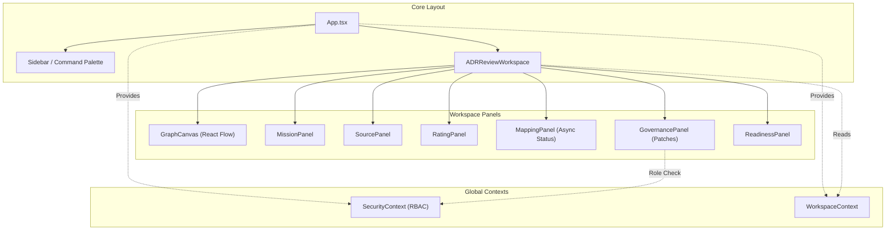

# 🗺️ PROJECT MAP — epios
> Автоматически сгенерировано: `2026-05-16 13:10:31`
> Скрипт: `node dev_studio/refresh.js`

## 📊 Telemetry / Context Health
| Metric | Value | Note |
|---|---|---|
| **Total Files** | `195` | Только JS/TS/TSX исходники |
| **Total Lines** | `23025` | Суммарно по проекту |
| **Project Weight** | `~186 146 tokens` | Оценка (4 символа/токен) |
| **Context Pressure** | `145.4%` | Нагрузка на окно 128k (Full Scan) |
| **Map Efficiency** | `~88%` | Экономия контекста через карту |

---

## Высокоуровневая архитектура
> Связи между основными пакетами и приложениями

```mermaid
flowchart LR

subgraph 0["apps"]
subgraph 1["work-shell"]
2["check-icons.js"]
subgraph B["src"]
C["App.tsx"]
subgraph H["components"]
I["ADRReviewWorkspace.tsx"]
5X["ApprovalPanel.tsx"]
5Y["ArtifactPatchPanel.tsx"]
5Z["FinalADRPanel.tsx"]
60["GovernancePanel.tsx"]
61["ReadinessPanel.tsx"]
62["SecureMcpIframe.tsx"]
63["ArchiveView.tsx"]
6H["AuthScreen.tsx"]
6I["CommandPalette.tsx"]
6J["SecurityDashboard.tsx"]
6K["Sidebar.tsx"]
6L["Modal.tsx"]
6M["SettingsModal.tsx"]
6N["AssignmentManager.tsx"]
6O["RoleSwitcher.tsx"]
6P["SidebarItem.tsx"]
6Q["WorkspaceRoom.tsx"]
6R["GraphCanvas.tsx"]
6T["CustomNode.tsx"]
6U["MissionPanel.tsx"]
6V["MappingPanel.tsx"]
6W["SourcePanel.tsx"]
6X["RatingPanel.tsx"]
end
P["api-config.ts"]
subgraph Q["context"]
R["SecurityContext.tsx"]
6A["WorkspaceContext.tsx"]
end
subgraph 5V["hooks"]
5W["useApi.ts"]
end
6Y["i18n.ts"]
7B["main.tsx"]
7C["index.css"]
subgraph 7H["mcp"]
7I["schemas.ts"]
end
subgraph 7J["utils"]
7K["api.ts"]
end
end
end
end
subgraph 3["node_modules"]
subgraph 4[".pnpm"]
subgraph 5["lucide-react@1.14.0_react@18.3.1"]
subgraph 6["node_modules"]
subgraph 7["lucide-react"]
subgraph 8["dist"]
subgraph 9["cjs"]
A["lucide-react.js"]
end
end
end
end
end
subgraph D["react@18.3.1"]
subgraph E["node_modules"]
subgraph F["react"]
G["index.js"]
end
end
end
subgraph J["framer-motion@12.38.0_react-dom@18.3.1_react@18.3.1__react@18.3.1"]
subgraph K["node_modules"]
subgraph L["framer-motion"]
subgraph M["dist"]
subgraph N["cjs"]
O["index.js"]
end
end
end
end
end
subgraph X["@fastify+cors@8.5.0"]
subgraph Y["node_modules"]
subgraph Z["@fastify"]
subgraph 10["cors"]
11["index.js"]
end
end
end
end
subgraph 12["dotenv@16.6.1"]
subgraph 13["node_modules"]
subgraph 14["dotenv"]
subgraph 15["lib"]
16["main.js"]
end
end
end
end
subgraph 17["dotenv-expand@11.0.7"]
subgraph 18["node_modules"]
subgraph 19["dotenv-expand"]
subgraph 1A["lib"]
1B["main.js"]
end
end
end
end
subgraph 1C["drizzle-orm@0.45.2_postgres@3.4.9"]
subgraph 1D["node_modules"]
subgraph 1E["drizzle-orm"]
subgraph 1F["postgres-js"]
1G["index.js"]
98["migrator.js"]
end
4Z["index.js"]
subgraph 51["pg-core"]
52["index.js"]
end
end
end
end
subgraph 1H["fastify@4.29.1"]
subgraph 1I["node_modules"]
subgraph 1J["fastify"]
1K["fastify.js"]
end
end
end
subgraph 1L["postgres@3.4.9"]
subgraph 1M["node_modules"]
subgraph 1N["postgres"]
subgraph 1O["src"]
1P["index.js"]
end
end
end
end
subgraph 4N["zod@4.4.3"]
subgraph 4O["node_modules"]
subgraph 4P["zod"]
4Q["index.js"]
end
end
end
subgraph 5N["bcrypt@6.0.0"]
subgraph 5O["node_modules"]
subgraph 5P["bcrypt"]
5Q["bcrypt.js"]
end
end
end
subgraph 5R["jsonwebtoken@9.0.3"]
subgraph 5S["node_modules"]
subgraph 5T["jsonwebtoken"]
5U["index.js"]
end
end
end
subgraph 64["react-i18next@17.0.7_i18next@26.1.0_typescript@5.9.3__react-dom@18.3.1_react@18.3.1__react@18.3.1_typescript@5.9.3"]
subgraph 65["node_modules"]
subgraph 66["react-i18next"]
subgraph 67["dist"]
subgraph 68["es"]
69["index.js"]
end
end
end
end
end
subgraph 6B["reactflow@11.11.4_@types+react@18.3.28_react-dom@18.3.1_react@18.3.1__react@18.3.1"]
subgraph 6C["node_modules"]
subgraph 6D["reactflow"]
subgraph 6E["dist"]
subgraph 6F["esm"]
6G["index.mjs"]
end
6S["style.css"]
end
end
end
end
subgraph 6Z["i18next@26.1.0_typescript@5.9.3"]
subgraph 70["node_modules"]
subgraph 71["i18next"]
subgraph 72["dist"]
subgraph 73["esm"]
74["i18next.js"]
end
end
end
end
end
subgraph 75["i18next-browser-languagedetector@8.2.1"]
subgraph 76["node_modules"]
subgraph 77["i18next-browser-languagedetector"]
subgraph 78["dist"]
subgraph 79["esm"]
7A["i18nextBrowserLanguageDetector.js"]
end
end
end
end
end
subgraph 7D["react-dom@18.3.1_react@18.3.1"]
subgraph 7E["node_modules"]
subgraph 7F["react-dom"]
7G["client.js"]
end
end
end
subgraph 7T["vitest@1.6.1_@types+node@25.7.0"]
subgraph 7U["node_modules"]
subgraph 7V["vitest"]
subgraph 7W["dist"]
7X["index.js"]
81["config.cjs"]
end
end
end
end
subgraph 8S["drizzle-kit@0.31.10"]
subgraph 8T["node_modules"]
subgraph 8U["drizzle-kit"]
8V["index.mjs"]
end
end
end
subgraph 92["@testcontainers+postgresql@10.28.0"]
subgraph 93["node_modules"]
subgraph 94["@testcontainers"]
subgraph 95["postgresql"]
subgraph 96["build"]
97["index.js"]
end
end
end
end
end
end
end
subgraph S["packages"]
subgraph T["api"]
subgraph U["src"]
V["index.ts"]
W["server.ts"]
1Q["identity-context.ts"]
48["mock-data.ts"]
subgraph 49["routes"]
4A["adr.routes.ts"]
4B["governance.routes.ts"]
4C["identity.routes.ts"]
4D["mapping.routes.ts"]
4G["mcp.routes.ts"]
4R["rating.routes.ts"]
4S["security.routes.ts"]
4T["source.routes.ts"]
4U["workspace.routes.ts"]
end
subgraph 4E["dto"]
4F["index.ts"]
end
7L["bin.ts"]
subgraph 7M["contracts"]
7N["openapi.ts"]
7O["schemas.ts"]
end
7P["ui-wrapper.ts"]
end
subgraph 7R["test"]
7S["adr.test.ts"]
7Y["api.test.ts"]
end
7Z["vitest.config.ts"]
end
subgraph 1R["application"]
subgraph 1S["src"]
1T["index.ts"]
1U["mapping-processor.ts"]
subgraph 2W["use-cases"]
2X["add-edge.ts"]
33["add-node.ts"]
34["adr-use-cases.ts"]
35["apply-artifact-patch.ts"]
36["apply-patch.ts"]
37["apply-retention.ts"]
38["assess-readiness.ts"]
39["cast-vote.ts"]
3A["create-mission.ts"]
3B["create-workspace.ts"]
3C["delete-mission.ts"]
3D["delete-source.ts"]
3E["generate-final-adr.ts"]
3F["get-mapping-run.ts"]
3G["get-node-ratings.ts"]
3H["get-readiness.ts"]
3I["get-trace-summary.ts"]
3J["get-trace.ts"]
3K["get-workspace-graph.ts"]
subgraph 3L["identity"]
3M["list-all-assignments.ts"]
3N["list-user-assignments.ts"]
3O["manage-assignment.ts"]
end
3P["ingest-source.ts"]
3Q["list-approvals.ts"]
3R["list-artifact-patches.ts"]
3S["list-mapping-runs.ts"]
3T["list-patches.ts"]
3U["list-sources.ts"]
3V["list-workspaces.ts"]
3W["login.ts"]
3X["patch-node.ts"]
3Y["patch-workspace.ts"]
3Z["propose-artifact-patch.ts"]
40["propose-patch.ts"]
41["rate-node.ts"]
42["rate-source.ts"]
43["redact-node.ts"]
44["resolve-approval.ts"]
45["run-mapping.ts"]
46["submit-claim.ts"]
47["update-mission-brief.ts"]
end
subgraph 82["__tests__"]
83["readiness.test.ts"]
end
end
subgraph 84["test"]
85["artifact-patch-flow.test.ts"]
86["async-runtime.test.ts"]
87["create-workspace.test.ts"]
88["mission.use-cases.test.ts"]
89["use-cases.test.ts"]
end
8A["vitest.config.ts"]
end
subgraph 1W["domain"]
subgraph 1X["src"]
1Y["index.ts"]
1Z["adr.ts"]
20["approval.ts"]
21["errors.ts"]
22["events.ts"]
23["mission.ts"]
24["artifact.ts"]
25["decision.ts"]
26["evidence.ts"]
27["governance.ts"]
28["node.ts"]
29["identity.ts"]
2A["mapping.ts"]
2B["policy.ts"]
2C["rating.ts"]
2D["security.ts"]
2E["source.ts"]
2F["workspace.ts"]
end
subgraph 8B["test"]
8C["domain-smoke.test.ts"]
8D["evidence.test.ts"]
8E["mission.test.ts"]
8F["node-invariants.test.ts"]
8G["patch-policy.test.ts"]
8H["source-rating.test.ts"]
8I["workspace.test.ts"]
end
8J["vitest.config.ts"]
end
subgraph 2G["ports"]
subgraph 2H["src"]
2I["index.ts"]
2J["adr.repository.port.ts"]
2K["artifact.repository.port.ts"]
2L["decision.repository.port.ts"]
2M["domain.repository.port.ts"]
2N["evidence.repository.port.ts"]
2O["governance.port.ts"]
2P["graph.repository.port.ts"]
2Q["identity.repository.port.ts"]
2R["mcp.port.ts"]
2S["mission.repository.port.ts"]
2T["outbox.repository.port.ts"]
2U["security.port.ts"]
2V["unit-of-work.port.ts"]
9F["mapping.repository.port.ts"]
end
end
subgraph 2Y["observability"]
subgraph 2Z["src"]
30["index.ts"]
31["audit.ts"]
32["tracer.ts"]
end
subgraph 9D["test"]
9E["redaction.test.ts"]
end
end
subgraph 4H["infrastructure-mcp"]
subgraph 4I["src"]
4J["index.ts"]
4K["mcp-app.registry.ts"]
4L["mcp-bridge.ts"]
4M["schemas.ts"]
end
subgraph 8K["test"]
8L["mcp-bridge.test.ts"]
8M["security.test.ts"]
8N["smoke.test.ts"]
end
end
subgraph 4V["infrastructure-postgres"]
subgraph 4W["src"]
4X["index.ts"]
4Y["artifact.repository.ts"]
50["schema.ts"]
53["decision.repository.ts"]
54["evidence.repository.ts"]
55["governance.repository.ts"]
56["graph.repository.ts"]
57["identity.repository.ts"]
58["mapping.repository.ts"]
59["mission.repository.ts"]
5A["outbox.repository.ts"]
5B["rating.repository.ts"]
5C["source.repository.ts"]
5D["unit-of-work.ts"]
5E["workspace.repository.ts"]
8W["manual_migrate.ts"]
subgraph 8X["scripts"]
8Y["seed-identity.ts"]
end
8Z["seed.ts"]
end
8R["drizzle.config.ts"]
subgraph 90["test"]
91["container-setup.ts"]
9A["graph-concurrency.test.ts"]
9B["repository-integration.test.ts"]
9C["transactional-integrity.test.ts"]
end
end
subgraph 5F["infrastructure-runtime"]
subgraph 5G["src"]
5H["index.ts"]
5I["in-memory-governance.repository.ts"]
5J["in-memory-repositories.ts"]
5K["in-memory-unit-of-work.ts"]
5L["outbox-worker.ts"]
5M["security-mocks.ts"]
end
end
subgraph 8O["infrastructure-models"]
subgraph 8P["src"]
8Q["index.ts"]
end
end
subgraph 9G["testing"]
subgraph 9H["src"]
9I["fixtures.ts"]
9J["index.ts"]
end
end
end
1V["crypto"]
7Q["child_process"]
80["path"]
99["url"]
2-->A
C-->I
C-->63
C-->6H
C-->6I
C-->6J
C-->6K
C-->6Q
C-->R
C-->6A
C-->G
I-->P
I-->R
I-->5W
I-->5X
I-->5Y
I-->5Z
I-->60
I-->61
I-->62
I-->O
I-->A
I-->G
R-->P
R-->V
R-->G
V-->W
V-->1Y
V-->4J
W-->1Q
W-->48
W-->4A
W-->4B
W-->4C
W-->4D
W-->4G
W-->4R
W-->4S
W-->4T
W-->4U
W-->1T
W-->1Y
W-->4J
W-->4X
W-->5H
W-->2I
W-->11
W-->16
W-->1B
W-->1G
W-->1K
W-->1P
1Q-->1T
1Q-->2I
1T-->1U
1T-->2X
1T-->33
1T-->34
1T-->35
1T-->36
1T-->37
1T-->38
1T-->39
1T-->3A
1T-->3B
1T-->3C
1T-->3D
1T-->3E
1T-->3F
1T-->3G
1T-->3H
1T-->3I
1T-->3J
1T-->3K
1T-->3M
1T-->3N
1T-->3O
1T-->3P
1T-->3Q
1T-->3R
1T-->3S
1T-->3T
1T-->3U
1T-->3V
1T-->3W
1T-->3X
1T-->3Y
1T-->3Z
1T-->40
1T-->41
1T-->42
1T-->43
1T-->44
1T-->45
1T-->46
1T-->47
1U-->1Y
1U-->2I
1U-->1V
1Y-->1Z
1Y-->20
1Y-->24
1Y-->25
1Y-->21
1Y-->22
1Y-->26
1Y-->27
1Y-->29
1Y-->2A
1Y-->23
1Y-->28
1Y-->2B
1Y-->2C
1Y-->2D
1Y-->2E
1Y-->2F
20-->21
20-->22
20-->23
23-->21
23-->22
24-->21
24-->22
24-->23
25-->23
26-->21
27-->21
27-->22
27-->28
28-->21
28-->22
29-->21
2B-->24
2D-->29
2E-->21
2F-->21
2I-->2J
2I-->2K
2I-->2L
2I-->2M
2I-->2N
2I-->2O
2I-->2P
2I-->2Q
2I-->2R
2I-->2S
2I-->2T
2I-->2U
2I-->2V
2J-->1Y
2K-->1Y
2L-->1Y
2M-->1Y
2N-->1Y
2O-->1Y
2P-->1Y
2Q-->1Y
2S-->1Y
2U-->1Y
2V-->2K
2V-->2L
2V-->2M
2V-->2N
2V-->2O
2V-->2P
2V-->2S
2V-->2T
2X-->1Y
2X-->30
2X-->2I
2X-->1V
30-->31
30-->32
33-->1Y
33-->30
33-->2I
33-->1V
34-->1Y
34-->2I
35-->1Y
35-->2I
35-->1V
36-->1Y
36-->2I
36-->1V
37-->1Y
37-->2I
38-->1Y
38-->2I
38-->1V
39-->1Y
39-->30
39-->2I
39-->1V
3A-->1Y
3A-->2I
3A-->1V
3B-->1Y
3B-->30
3B-->2I
3B-->1V
3C-->2I
3C-->1V
3D-->2I
3D-->1V
3E-->1Y
3E-->2I
3F-->1Y
3F-->2I
3G-->1Y
3G-->2I
3H-->1Y
3H-->2I
3I-->2I
3J-->1Y
3J-->2I
3K-->1Y
3K-->2I
3M-->1Y
3M-->2I
3N-->1Y
3N-->2I
3O-->1Y
3O-->2I
3P-->1Y
3P-->2I
3P-->1V
3Q-->1Y
3Q-->2I
3R-->1Y
3R-->2I
3S-->1Y
3S-->2I
3T-->1Y
3T-->2I
3U-->1Y
3U-->2I
3V-->1Y
3V-->2I
3W-->1Y
3W-->2I
3X-->1Y
3X-->2I
3Y-->1Y
3Y-->2I
3Z-->1Y
3Z-->2I
3Z-->1V
40-->1Y
40-->2I
40-->1V
41-->1Y
41-->2I
41-->1V
42-->1Y
42-->2I
42-->1V
43-->1Y
43-->2I
44-->1Y
44-->2I
44-->1V
45-->1Y
45-->2I
45-->1V
46-->1Y
46-->2I
46-->1V
47-->1Y
47-->2I
47-->1V
48-->1Y
4A-->1T
4A-->1K
4B-->1T
4B-->1Y
4B-->2I
4B-->1K
4C-->1Q
4C-->1K
4D-->4F
4D-->1T
4D-->1K
4F-->1Y
4G-->4J
4G-->2I
4G-->1K
4J-->4K
4J-->4L
4J-->4M
4K-->2I
4L-->4M
4L-->1Y
4L-->2I
4M-->4Q
4R-->1T
4R-->1Y
4R-->1K
4S-->1T
4S-->1Y
4S-->2I
4S-->1K
4T-->1T
4T-->1Y
4T-->1K
4U-->4F
4U-->1T
4U-->1K
4X-->4Y
4X-->53
4X-->54
4X-->55
4X-->56
4X-->57
4X-->58
4X-->59
4X-->5A
4X-->5B
4X-->50
4X-->5C
4X-->5D
4X-->5E
4Y-->50
4Y-->1Y
4Y-->2I
4Y-->4Z
4Y-->1G
50-->52
53-->50
53-->1Y
53-->2I
53-->4Z
53-->1G
54-->50
54-->1Y
54-->2I
54-->4Z
54-->1G
55-->50
55-->1Y
55-->30
55-->2I
55-->4Z
55-->1G
56-->50
56-->1Y
56-->2I
56-->4Z
56-->1G
57-->50
57-->1Y
57-->2I
57-->4Z
57-->1G
58-->50
58-->1Y
58-->2I
58-->4Z
58-->1G
59-->50
59-->1Y
59-->2I
59-->4Z
59-->1G
5A-->50
5A-->2I
5A-->4Z
5A-->1G
5B-->50
5B-->1Y
5B-->2I
5B-->4Z
5B-->1G
5C-->50
5C-->1Y
5C-->2I
5C-->1V
5C-->4Z
5C-->1G
5D-->4Y
5D-->53
5D-->54
5D-->55
5D-->56
5D-->58
5D-->59
5D-->5A
5D-->5B
5D-->5C
5D-->5E
5D-->2I
5D-->1G
5E-->50
5E-->1Y
5E-->2I
5E-->4Z
5E-->1G
5H-->5I
5H-->5J
5H-->5K
5H-->5L
5H-->5M
5I-->1Y
5I-->2I
5J-->1Y
5J-->2I
5K-->2I
5L-->30
5L-->2I
5M-->1Y
5M-->2I
5M-->5Q
5M-->1V
5M-->5U
5W-->P
5W-->R
5W-->G
5X-->P
5X-->R
5X-->O
5X-->A
5X-->G
5Y-->P
5Y-->R
5Y-->O
5Y-->A
5Y-->G
5Z-->P
5Z-->O
5Z-->A
5Z-->G
60-->P
60-->R
60-->O
60-->A
60-->G
61-->P
61-->O
61-->A
61-->G
62-->V
62-->G
63-->6A
63-->O
63-->A
63-->G
63-->69
6A-->P
6A-->5W
6A-->R
6A-->V
6A-->G
6A-->6G
6H-->P
6H-->V
6H-->A
6I-->6A
6I-->O
6I-->A
6I-->G
6J-->G
6K-->P
6K-->R
6K-->6A
6K-->6L
6K-->6M
6K-->6P
6K-->V
6K-->O
6K-->A
6K-->G
6K-->69
6L-->O
6L-->A
6L-->G
6M-->R
6M-->6N
6M-->6L
6M-->6O
6M-->6J
6M-->A
6M-->G
6M-->69
6N-->A
6N-->G
6O-->R
6O-->A
6O-->G
6P-->O
6P-->A
6P-->G
6P-->69
6Q-->P
6Q-->R
6Q-->6A
6Q-->6R
6Q-->6U
6Q-->6X
6Q-->V
6Q-->O
6Q-->A
6Q-->G
6R-->6A
6R-->5W
6R-->6T
6R-->A
6R-->G
6R-->6G
6R-->6S
6T-->A
6T-->G
6T-->6G
6U-->60
6U-->6V
6U-->6W
6U-->V
6U-->O
6U-->A
6U-->G
6V-->P
6V-->V
6V-->O
6V-->A
6V-->G
6W-->P
6W-->O
6W-->A
6W-->G
6X-->P
6X-->A
6X-->G
6Y-->74
6Y-->7A
6Y-->69
7B-->C
7B-->R
7B-->6A
7B-->6Y
7B-->7C
7B-->G
7B-->7G
7B-->6S
7I-->4Q
7K-->P
7L-->W
7O-->4Q
7P-->7Q
7S-->W
7S-->1K
7S-->7X
7Y-->W
7Y-->1Y
7Y-->2I
7Y-->1K
7Y-->7X
7Z-->80
7Z-->81
83-->38
83-->2I
83-->7X
85-->1T
85-->1Y
85-->5H
85-->7X
86-->45
86-->2I
86-->1V
86-->7X
87-->3B
87-->2I
87-->7X
88-->3A
88-->3P
88-->45
88-->47
88-->1Y
88-->2I
88-->7X
89-->2X
89-->33
89-->39
89-->3B
89-->3K
89-->3V
89-->3X
89-->46
89-->1Y
89-->2I
89-->7X
8A-->80
8A-->81
8C-->1Y
8C-->7X
8D-->26
8D-->7X
8E-->23
8E-->7X
8F-->1Y
8F-->7X
8G-->1Y
8G-->7X
8H-->1Y
8H-->7X
8I-->21
8I-->2F
8I-->7X
8J-->81
8L-->4L
8L-->2I
8L-->7X
8M-->4L
8M-->1Y
8M-->2I
8M-->7X
8N-->7X
8R-->16
8R-->1B
8R-->8V
8W-->16
8W-->1B
8W-->1P
8Y-->50
8Y-->5Q
8Y-->1V
8Y-->16
8Y-->1G
8Y-->1P
8Z-->50
8Z-->16
8Z-->1B
8Z-->1G
8Z-->1P
91-->97
91-->1G
91-->98
91-->80
91-->1P
91-->99
9A-->56
9A-->91
9A-->1Y
9A-->97
9A-->1G
9A-->1P
9A-->7X
9B-->5E
9B-->91
9B-->1Y
9B-->97
9B-->1G
9B-->1P
9B-->7X
9C-->59
9C-->5D
9C-->5E
9C-->91
9C-->1Y
9C-->97
9C-->1G
9C-->1P
9C-->7X
9E-->32
9E-->7X
9F-->1Y
9I-->1Y
9J-->9I
```

## Детальная карта компонентов
> Полный граф зависимостей всех файлов проекта

```mermaid
flowchart LR

subgraph 0["apps"]
subgraph 1["work-shell"]
2["check-icons.js"]
subgraph B["src"]
C["App.tsx"]
subgraph H["components"]
I["ADRReviewWorkspace.tsx"]
5X["ApprovalPanel.tsx"]
5Y["ArtifactPatchPanel.tsx"]
5Z["FinalADRPanel.tsx"]
60["GovernancePanel.tsx"]
61["ReadinessPanel.tsx"]
62["SecureMcpIframe.tsx"]
63["ArchiveView.tsx"]
6H["AuthScreen.tsx"]
6I["CommandPalette.tsx"]
6J["SecurityDashboard.tsx"]
6K["Sidebar.tsx"]
6L["Modal.tsx"]
6M["SettingsModal.tsx"]
6N["AssignmentManager.tsx"]
6O["RoleSwitcher.tsx"]
6P["SidebarItem.tsx"]
6Q["WorkspaceRoom.tsx"]
6R["GraphCanvas.tsx"]
6T["CustomNode.tsx"]
6U["MissionPanel.tsx"]
6V["MappingPanel.tsx"]
6W["SourcePanel.tsx"]
6X["RatingPanel.tsx"]
end
P["api-config.ts"]
subgraph Q["context"]
R["SecurityContext.tsx"]
6A["WorkspaceContext.tsx"]
end
subgraph 5V["hooks"]
5W["useApi.ts"]
end
6Y["i18n.ts"]
7B["main.tsx"]
7C["index.css"]
subgraph 7H["mcp"]
7I["schemas.ts"]
end
subgraph 7J["utils"]
7K["api.ts"]
end
end
end
end
subgraph 3["node_modules"]
subgraph 4[".pnpm"]
subgraph 5["lucide-react@1.14.0_react@18.3.1"]
subgraph 6["node_modules"]
subgraph 7["lucide-react"]
subgraph 8["dist"]
subgraph 9["cjs"]
A["lucide-react.js"]
end
end
end
end
end
subgraph D["react@18.3.1"]
subgraph E["node_modules"]
subgraph F["react"]
G["index.js"]
end
end
end
subgraph J["framer-motion@12.38.0_react-dom@18.3.1_react@18.3.1__react@18.3.1"]
subgraph K["node_modules"]
subgraph L["framer-motion"]
subgraph M["dist"]
subgraph N["cjs"]
O["index.js"]
end
end
end
end
end
subgraph X["@fastify+cors@8.5.0"]
subgraph Y["node_modules"]
subgraph Z["@fastify"]
subgraph 10["cors"]
11["index.js"]
end
end
end
end
subgraph 12["dotenv@16.6.1"]
subgraph 13["node_modules"]
subgraph 14["dotenv"]
subgraph 15["lib"]
16["main.js"]
end
end
end
end
subgraph 17["dotenv-expand@11.0.7"]
subgraph 18["node_modules"]
subgraph 19["dotenv-expand"]
subgraph 1A["lib"]
1B["main.js"]
end
end
end
end
subgraph 1C["drizzle-orm@0.45.2_postgres@3.4.9"]
subgraph 1D["node_modules"]
subgraph 1E["drizzle-orm"]
subgraph 1F["postgres-js"]
1G["index.js"]
98["migrator.js"]
end
4Z["index.js"]
subgraph 51["pg-core"]
52["index.js"]
end
end
end
end
subgraph 1H["fastify@4.29.1"]
subgraph 1I["node_modules"]
subgraph 1J["fastify"]
1K["fastify.js"]
end
end
end
subgraph 1L["postgres@3.4.9"]
subgraph 1M["node_modules"]
subgraph 1N["postgres"]
subgraph 1O["src"]
1P["index.js"]
end
end
end
end
subgraph 4N["zod@4.4.3"]
subgraph 4O["node_modules"]
subgraph 4P["zod"]
4Q["index.js"]
end
end
end
subgraph 5N["bcrypt@6.0.0"]
subgraph 5O["node_modules"]
subgraph 5P["bcrypt"]
5Q["bcrypt.js"]
end
end
end
subgraph 5R["jsonwebtoken@9.0.3"]
subgraph 5S["node_modules"]
subgraph 5T["jsonwebtoken"]
5U["index.js"]
end
end
end
subgraph 64["react-i18next@17.0.7_i18next@26.1.0_typescript@5.9.3__react-dom@18.3.1_react@18.3.1__react@18.3.1_typescript@5.9.3"]
subgraph 65["node_modules"]
subgraph 66["react-i18next"]
subgraph 67["dist"]
subgraph 68["es"]
69["index.js"]
end
end
end
end
end
subgraph 6B["reactflow@11.11.4_@types+react@18.3.28_react-dom@18.3.1_react@18.3.1__react@18.3.1"]
subgraph 6C["node_modules"]
subgraph 6D["reactflow"]
subgraph 6E["dist"]
subgraph 6F["esm"]
6G["index.mjs"]
end
6S["style.css"]
end
end
end
end
subgraph 6Z["i18next@26.1.0_typescript@5.9.3"]
subgraph 70["node_modules"]
subgraph 71["i18next"]
subgraph 72["dist"]
subgraph 73["esm"]
74["i18next.js"]
end
end
end
end
end
subgraph 75["i18next-browser-languagedetector@8.2.1"]
subgraph 76["node_modules"]
subgraph 77["i18next-browser-languagedetector"]
subgraph 78["dist"]
subgraph 79["esm"]
7A["i18nextBrowserLanguageDetector.js"]
end
end
end
end
end
subgraph 7D["react-dom@18.3.1_react@18.3.1"]
subgraph 7E["node_modules"]
subgraph 7F["react-dom"]
7G["client.js"]
end
end
end
subgraph 7T["vitest@1.6.1_@types+node@25.7.0"]
subgraph 7U["node_modules"]
subgraph 7V["vitest"]
subgraph 7W["dist"]
7X["index.js"]
81["config.cjs"]
end
end
end
end
subgraph 8S["drizzle-kit@0.31.10"]
subgraph 8T["node_modules"]
subgraph 8U["drizzle-kit"]
8V["index.mjs"]
end
end
end
subgraph 92["@testcontainers+postgresql@10.28.0"]
subgraph 93["node_modules"]
subgraph 94["@testcontainers"]
subgraph 95["postgresql"]
subgraph 96["build"]
97["index.js"]
end
end
end
end
end
end
end
subgraph S["packages"]
subgraph T["api"]
subgraph U["src"]
V["index.ts"]
W["server.ts"]
1Q["identity-context.ts"]
48["mock-data.ts"]
subgraph 49["routes"]
4A["adr.routes.ts"]
4B["governance.routes.ts"]
4C["identity.routes.ts"]
4D["mapping.routes.ts"]
4G["mcp.routes.ts"]
4R["rating.routes.ts"]
4S["security.routes.ts"]
4T["source.routes.ts"]
4U["workspace.routes.ts"]
end
subgraph 4E["dto"]
4F["index.ts"]
end
7L["bin.ts"]
subgraph 7M["contracts"]
7N["openapi.ts"]
7O["schemas.ts"]
end
7P["ui-wrapper.ts"]
end
subgraph 7R["test"]
7S["adr.test.ts"]
7Y["api.test.ts"]
end
7Z["vitest.config.ts"]
end
subgraph 1R["application"]
subgraph 1S["src"]
1T["index.ts"]
1U["mapping-processor.ts"]
subgraph 2W["use-cases"]
2X["add-edge.ts"]
33["add-node.ts"]
34["adr-use-cases.ts"]
35["apply-artifact-patch.ts"]
36["apply-patch.ts"]
37["apply-retention.ts"]
38["assess-readiness.ts"]
39["cast-vote.ts"]
3A["create-mission.ts"]
3B["create-workspace.ts"]
3C["delete-mission.ts"]
3D["delete-source.ts"]
3E["generate-final-adr.ts"]
3F["get-mapping-run.ts"]
3G["get-node-ratings.ts"]
3H["get-readiness.ts"]
3I["get-trace-summary.ts"]
3J["get-trace.ts"]
3K["get-workspace-graph.ts"]
subgraph 3L["identity"]
3M["list-all-assignments.ts"]
3N["list-user-assignments.ts"]
3O["manage-assignment.ts"]
end
3P["ingest-source.ts"]
3Q["list-approvals.ts"]
3R["list-artifact-patches.ts"]
3S["list-mapping-runs.ts"]
3T["list-patches.ts"]
3U["list-sources.ts"]
3V["list-workspaces.ts"]
3W["login.ts"]
3X["patch-node.ts"]
3Y["patch-workspace.ts"]
3Z["propose-artifact-patch.ts"]
40["propose-patch.ts"]
41["rate-node.ts"]
42["rate-source.ts"]
43["redact-node.ts"]
44["resolve-approval.ts"]
45["run-mapping.ts"]
46["submit-claim.ts"]
47["update-mission-brief.ts"]
end
subgraph 82["__tests__"]
83["readiness.test.ts"]
end
end
subgraph 84["test"]
85["artifact-patch-flow.test.ts"]
86["async-runtime.test.ts"]
87["create-workspace.test.ts"]
88["mission.use-cases.test.ts"]
89["use-cases.test.ts"]
end
8A["vitest.config.ts"]
end
subgraph 1W["domain"]
subgraph 1X["src"]
1Y["index.ts"]
1Z["adr.ts"]
20["approval.ts"]
21["errors.ts"]
22["events.ts"]
23["mission.ts"]
24["artifact.ts"]
25["decision.ts"]
26["evidence.ts"]
27["governance.ts"]
28["node.ts"]
29["identity.ts"]
2A["mapping.ts"]
2B["policy.ts"]
2C["rating.ts"]
2D["security.ts"]
2E["source.ts"]
2F["workspace.ts"]
end
subgraph 8B["test"]
8C["domain-smoke.test.ts"]
8D["evidence.test.ts"]
8E["mission.test.ts"]
8F["node-invariants.test.ts"]
8G["patch-policy.test.ts"]
8H["source-rating.test.ts"]
8I["workspace.test.ts"]
end
8J["vitest.config.ts"]
end
subgraph 2G["ports"]
subgraph 2H["src"]
2I["index.ts"]
2J["adr.repository.port.ts"]
2K["artifact.repository.port.ts"]
2L["decision.repository.port.ts"]
2M["domain.repository.port.ts"]
2N["evidence.repository.port.ts"]
2O["governance.port.ts"]
2P["graph.repository.port.ts"]
2Q["identity.repository.port.ts"]
2R["mcp.port.ts"]
2S["mission.repository.port.ts"]
2T["outbox.repository.port.ts"]
2U["security.port.ts"]
2V["unit-of-work.port.ts"]
9F["mapping.repository.port.ts"]
end
end
subgraph 2Y["observability"]
subgraph 2Z["src"]
30["index.ts"]
31["audit.ts"]
32["tracer.ts"]
end
subgraph 9D["test"]
9E["redaction.test.ts"]
end
end
subgraph 4H["infrastructure-mcp"]
subgraph 4I["src"]
4J["index.ts"]
4K["mcp-app.registry.ts"]
4L["mcp-bridge.ts"]
4M["schemas.ts"]
end
subgraph 8K["test"]
8L["mcp-bridge.test.ts"]
8M["security.test.ts"]
8N["smoke.test.ts"]
end
end
subgraph 4V["infrastructure-postgres"]
subgraph 4W["src"]
4X["index.ts"]
4Y["artifact.repository.ts"]
50["schema.ts"]
53["decision.repository.ts"]
54["evidence.repository.ts"]
55["governance.repository.ts"]
56["graph.repository.ts"]
57["identity.repository.ts"]
58["mapping.repository.ts"]
59["mission.repository.ts"]
5A["outbox.repository.ts"]
5B["rating.repository.ts"]
5C["source.repository.ts"]
5D["unit-of-work.ts"]
5E["workspace.repository.ts"]
8W["manual_migrate.ts"]
subgraph 8X["scripts"]
8Y["seed-identity.ts"]
end
8Z["seed.ts"]
end
8R["drizzle.config.ts"]
subgraph 90["test"]
91["container-setup.ts"]
9A["graph-concurrency.test.ts"]
9B["repository-integration.test.ts"]
9C["transactional-integrity.test.ts"]
end
end
subgraph 5F["infrastructure-runtime"]
subgraph 5G["src"]
5H["index.ts"]
5I["in-memory-governance.repository.ts"]
5J["in-memory-repositories.ts"]
5K["in-memory-unit-of-work.ts"]
5L["outbox-worker.ts"]
5M["security-mocks.ts"]
end
end
subgraph 8O["infrastructure-models"]
subgraph 8P["src"]
8Q["index.ts"]
end
end
subgraph 9G["testing"]
subgraph 9H["src"]
9I["fixtures.ts"]
9J["index.ts"]
end
end
end
1V["crypto"]
7Q["child_process"]
80["path"]
99["url"]
2-->A
C-->I
C-->63
C-->6H
C-->6I
C-->6J
C-->6K
C-->6Q
C-->R
C-->6A
C-->G
I-->P
I-->R
I-->5W
I-->5X
I-->5Y
I-->5Z
I-->60
I-->61
I-->62
I-->O
I-->A
I-->G
R-->P
R-->V
R-->G
V-->W
V-->1Y
V-->4J
W-->1Q
W-->48
W-->4A
W-->4B
W-->4C
W-->4D
W-->4G
W-->4R
W-->4S
W-->4T
W-->4U
W-->1T
W-->1Y
W-->4J
W-->4X
W-->5H
W-->2I
W-->11
W-->16
W-->1B
W-->1G
W-->1K
W-->1P
1Q-->1T
1Q-->2I
1T-->1U
1T-->2X
1T-->33
1T-->34
1T-->35
1T-->36
1T-->37
1T-->38
1T-->39
1T-->3A
1T-->3B
1T-->3C
1T-->3D
1T-->3E
1T-->3F
1T-->3G
1T-->3H
1T-->3I
1T-->3J
1T-->3K
1T-->3M
1T-->3N
1T-->3O
1T-->3P
1T-->3Q
1T-->3R
1T-->3S
1T-->3T
1T-->3U
1T-->3V
1T-->3W
1T-->3X
1T-->3Y
1T-->3Z
1T-->40
1T-->41
1T-->42
1T-->43
1T-->44
1T-->45
1T-->46
1T-->47
1U-->1Y
1U-->2I
1U-->1V
1Y-->1Z
1Y-->20
1Y-->24
1Y-->25
1Y-->21
1Y-->22
1Y-->26
1Y-->27
1Y-->29
1Y-->2A
1Y-->23
1Y-->28
1Y-->2B
1Y-->2C
1Y-->2D
1Y-->2E
1Y-->2F
20-->21
20-->22
20-->23
23-->21
23-->22
24-->21
24-->22
24-->23
25-->23
26-->21
27-->21
27-->22
27-->28
28-->21
28-->22
29-->21
2B-->24
2D-->29
2E-->21
2F-->21
2I-->2J
2I-->2K
2I-->2L
2I-->2M
2I-->2N
2I-->2O
2I-->2P
2I-->2Q
2I-->2R
2I-->2S
2I-->2T
2I-->2U
2I-->2V
2J-->1Y
2K-->1Y
2L-->1Y
2M-->1Y
2N-->1Y
2O-->1Y
2P-->1Y
2Q-->1Y
2S-->1Y
2U-->1Y
2V-->2K
2V-->2L
2V-->2M
2V-->2N
2V-->2O
2V-->2P
2V-->2S
2V-->2T
2X-->1Y
2X-->30
2X-->2I
2X-->1V
30-->31
30-->32
33-->1Y
33-->30
33-->2I
33-->1V
34-->1Y
34-->2I
35-->1Y
35-->2I
35-->1V
36-->1Y
36-->2I
36-->1V
37-->1Y
37-->2I
38-->1Y
38-->2I
38-->1V
39-->1Y
39-->30
39-->2I
39-->1V
3A-->1Y
3A-->2I
3A-->1V
3B-->1Y
3B-->30
3B-->2I
3B-->1V
3C-->2I
3C-->1V
3D-->2I
3D-->1V
3E-->1Y
3E-->2I
3F-->1Y
3F-->2I
3G-->1Y
3G-->2I
3H-->1Y
3H-->2I
3I-->2I
3J-->1Y
3J-->2I
3K-->1Y
3K-->2I
3M-->1Y
3M-->2I
3N-->1Y
3N-->2I
3O-->1Y
3O-->2I
3P-->1Y
3P-->2I
3P-->1V
3Q-->1Y
3Q-->2I
3R-->1Y
3R-->2I
3S-->1Y
3S-->2I
3T-->1Y
3T-->2I
3U-->1Y
3U-->2I
3V-->1Y
3V-->2I
3W-->1Y
3W-->2I
3X-->1Y
3X-->2I
3Y-->1Y
3Y-->2I
3Z-->1Y
3Z-->2I
3Z-->1V
40-->1Y
40-->2I
40-->1V
41-->1Y
41-->2I
41-->1V
42-->1Y
42-->2I
42-->1V
43-->1Y
43-->2I
44-->1Y
44-->2I
44-->1V
45-->1Y
45-->2I
45-->1V
46-->1Y
46-->2I
46-->1V
47-->1Y
47-->2I
47-->1V
48-->1Y
4A-->1T
4A-->1K
4B-->1T
4B-->1Y
4B-->2I
4B-->1K
4C-->1Q
4C-->1K
4D-->4F
4D-->1T
4D-->1K
4F-->1Y
4G-->4J
4G-->2I
4G-->1K
4J-->4K
4J-->4L
4J-->4M
4K-->2I
4L-->4M
4L-->1Y
4L-->2I
4M-->4Q
4R-->1T
4R-->1Y
4R-->1K
4S-->1T
4S-->1Y
4S-->2I
4S-->1K
4T-->1T
4T-->1Y
4T-->1K
4U-->4F
4U-->1T
4U-->1K
4X-->4Y
4X-->53
4X-->54
4X-->55
4X-->56
4X-->57
4X-->58
4X-->59
4X-->5A
4X-->5B
4X-->50
4X-->5C
4X-->5D
4X-->5E
4Y-->50
4Y-->1Y
4Y-->2I
4Y-->4Z
4Y-->1G
50-->52
53-->50
53-->1Y
53-->2I
53-->4Z
53-->1G
54-->50
54-->1Y
54-->2I
54-->4Z
54-->1G
55-->50
55-->1Y
55-->30
55-->2I
55-->4Z
55-->1G
56-->50
56-->1Y
56-->2I
56-->4Z
56-->1G
57-->50
57-->1Y
57-->2I
57-->4Z
57-->1G
58-->50
58-->1Y
58-->2I
58-->4Z
58-->1G
59-->50
59-->1Y
59-->2I
59-->4Z
59-->1G
5A-->50
5A-->2I
5A-->4Z
5A-->1G
5B-->50
5B-->1Y
5B-->2I
5B-->4Z
5B-->1G
5C-->50
5C-->1Y
5C-->2I
5C-->1V
5C-->4Z
5C-->1G
5D-->4Y
5D-->53
5D-->54
5D-->55
5D-->56
5D-->58
5D-->59
5D-->5A
5D-->5B
5D-->5C
5D-->5E
5D-->2I
5D-->1G
5E-->50
5E-->1Y
5E-->2I
5E-->4Z
5E-->1G
5H-->5I
5H-->5J
5H-->5K
5H-->5L
5H-->5M
5I-->1Y
5I-->2I
5J-->1Y
5J-->2I
5K-->2I
5L-->30
5L-->2I
5M-->1Y
5M-->2I
5M-->5Q
5M-->1V
5M-->5U
5W-->P
5W-->R
5W-->G
5X-->P
5X-->R
5X-->O
5X-->A
5X-->G
5Y-->P
5Y-->R
5Y-->O
5Y-->A
5Y-->G
5Z-->P
5Z-->O
5Z-->A
5Z-->G
60-->P
60-->R
60-->O
60-->A
60-->G
61-->P
61-->O
61-->A
61-->G
62-->V
62-->G
63-->6A
63-->O
63-->A
63-->G
63-->69
6A-->P
6A-->5W
6A-->R
6A-->V
6A-->G
6A-->6G
6H-->P
6H-->V
6H-->A
6I-->6A
6I-->O
6I-->A
6I-->G
6J-->G
6K-->P
6K-->R
6K-->6A
6K-->6L
6K-->6M
6K-->6P
6K-->V
6K-->O
6K-->A
6K-->G
6K-->69
6L-->O
6L-->A
6L-->G
6M-->R
6M-->6N
6M-->6L
6M-->6O
6M-->6J
6M-->A
6M-->G
6M-->69
6N-->A
6N-->G
6O-->R
6O-->A
6O-->G
6P-->O
6P-->A
6P-->G
6P-->69
6Q-->P
6Q-->R
6Q-->6A
6Q-->6R
6Q-->6U
6Q-->6X
6Q-->V
6Q-->O
6Q-->A
6Q-->G
6R-->6A
6R-->5W
6R-->6T
6R-->A
6R-->G
6R-->6G
6R-->6S
6T-->A
6T-->G
6T-->6G
6U-->60
6U-->6V
6U-->6W
6U-->V
6U-->O
6U-->A
6U-->G
6V-->P
6V-->V
6V-->O
6V-->A
6V-->G
6W-->P
6W-->O
6W-->A
6W-->G
6X-->P
6X-->A
6X-->G
6Y-->74
6Y-->7A
6Y-->69
7B-->C
7B-->R
7B-->6A
7B-->6Y
7B-->7C
7B-->G
7B-->7G
7B-->6S
7I-->4Q
7K-->P
7L-->W
7O-->4Q
7P-->7Q
7S-->W
7S-->1K
7S-->7X
7Y-->W
7Y-->1Y
7Y-->2I
7Y-->1K
7Y-->7X
7Z-->80
7Z-->81
83-->38
83-->2I
83-->7X
85-->1T
85-->1Y
85-->5H
85-->7X
86-->45
86-->2I
86-->1V
86-->7X
87-->3B
87-->2I
87-->7X
88-->3A
88-->3P
88-->45
88-->47
88-->1Y
88-->2I
88-->7X
89-->2X
89-->33
89-->39
89-->3B
89-->3K
89-->3V
89-->3X
89-->46
89-->1Y
89-->2I
89-->7X
8A-->80
8A-->81
8C-->1Y
8C-->7X
8D-->26
8D-->7X
8E-->23
8E-->7X
8F-->1Y
8F-->7X
8G-->1Y
8G-->7X
8H-->1Y
8H-->7X
8I-->21
8I-->2F
8I-->7X
8J-->81
8L-->4L
8L-->2I
8L-->7X
8M-->4L
8M-->1Y
8M-->2I
8M-->7X
8N-->7X
8R-->16
8R-->1B
8R-->8V
8W-->16
8W-->1B
8W-->1P
8Y-->50
8Y-->5Q
8Y-->1V
8Y-->16
8Y-->1G
8Y-->1P
8Z-->50
8Z-->16
8Z-->1B
8Z-->1G
8Z-->1P
91-->97
91-->1G
91-->98
91-->80
91-->1P
91-->99
9A-->56
9A-->91
9A-->1Y
9A-->97
9A-->1G
9A-->1P
9A-->7X
9B-->5E
9B-->91
9B-->1Y
9B-->97
9B-->1G
9B-->1P
9B-->7X
9C-->59
9C-->5D
9C-->5E
9C-->91
9C-->1Y
9C-->97
9C-->1G
9C-->1P
9C-->7X
9E-->32
9E-->7X
9F-->1Y
9I-->1Y
9J-->9I
```

## 🎨 Архитектура UI Интерфейсов (work-shell)
> Обобщенная концептуальная структура компонентов пользовательского интерфейса



> Подробная документация и Roadmap по развитию интерфейсов находится в [docs/05_ui_roadmap/](docs/05_ui_roadmap/00_ROADMAP_INDEX.md)

## Компонент: `apps`

| Файл | Строк | Размер | Описание |
|---|---|---|---|
| `work-shell/check-icons.js` | 3 | 0.1 KB | — |
| `work-shell/src/api-config.ts` | 7 | 0.3 KB | — |
| `work-shell/src/App.tsx` | 83 | 2.3 KB | — |
| `work-shell/src/components/ADRReviewWorkspace.tsx` | 955 | 31.6 KB | — |
| `work-shell/src/components/ApprovalPanel.tsx` | 311 | 9.5 KB | — |
| `work-shell/src/components/ArchiveView.tsx` | 247 | 7.4 KB | — |
| `work-shell/src/components/ArtifactPatchPanel.tsx` | 286 | 8.8 KB | — |
| `work-shell/src/components/AssignmentManager.tsx` | 328 | 13.1 KB | — |
| `work-shell/src/components/AuthScreen.tsx` | 252 | 9.2 KB | — |
| `work-shell/src/components/CommandPalette.tsx` | 341 | 9.1 KB | — |
| `work-shell/src/components/CustomNode.tsx` | 169 | 4.4 KB | — |
| `work-shell/src/components/FinalADRPanel.tsx` | 275 | 8.0 KB | — |
| `work-shell/src/components/GovernancePanel.tsx` | 583 | 19.0 KB | — |
| `work-shell/src/components/GraphCanvas.tsx` | 596 | 17.4 KB | — |
| `work-shell/src/components/MappingPanel.tsx` | 506 | 15.7 KB | — |
| `work-shell/src/components/MissionPanel.tsx` | 303 | 9.0 KB | — |
| `work-shell/src/components/Modal.tsx` | 102 | 2.9 KB | — |
| `work-shell/src/components/RatingPanel.tsx` | 234 | 6.2 KB | — |
| `work-shell/src/components/ReadinessPanel.tsx` | 416 | 12.1 KB | — |
| `work-shell/src/components/RoleSwitcher.tsx` | 126 | 3.3 KB | — |
| `work-shell/src/components/SecureMcpIframe.tsx` | 101 | 3.1 KB | — |
| `work-shell/src/components/SecurityDashboard.tsx` | 159 | 8.2 KB | — |
| `work-shell/src/components/SettingsModal.tsx` | 195 | 9.9 KB | — |
| `work-shell/src/components/Sidebar.tsx` | 502 | 16.2 KB | — |
| `work-shell/src/components/SidebarItem.tsx` | 280 | 8.1 KB | — |
| `work-shell/src/components/SourcePanel.tsx` | 232 | 6.9 KB | — |
| `work-shell/src/components/WorkspaceRoom.tsx` | 665 | 22.1 KB | — |
| `work-shell/src/context/SecurityContext.tsx` | 149 | 4.3 KB | — |
| `work-shell/src/context/WorkspaceContext.tsx` | 204 | 5.9 KB | — |
| `work-shell/src/hooks/useApi.ts` | 55 | 1.6 KB | — |
| `work-shell/src/i18n.ts` | 99 | 3.4 KB | — |
| `work-shell/src/main.tsx` | 20 | 0.5 KB | — |
| `work-shell/src/mcp/schemas.ts` | 20 | 0.7 KB | — |
| `work-shell/src/utils/api.ts` | 30 | 0.7 KB | — |

### `work-shell/src/api-config.ts`
- **Экспорт**: `API_BASE_URL`

### `work-shell/src/components/ApprovalPanel.tsx`
- **Экспорт**: `ApprovalPanel`
- **Зависимости**:
  - `../api-config` → API_BASE_URL
  - `../context/SecurityContext` → useSecurity

### `work-shell/src/components/ArchiveView.tsx`
- **Экспорт**: `ArchiveView`
- **Зависимости**:
  - `../context/WorkspaceContext` → useWorkspace

### `work-shell/src/components/ArtifactPatchPanel.tsx`
- **Экспорт**: `ArtifactPatchPanel`
- **Зависимости**:
  - `../api-config` → API_BASE_URL
  - `../context/SecurityContext` → useSecurity

### `work-shell/src/components/FinalADRPanel.tsx`
- **Экспорт**: `FinalADRPanel`
- **Зависимости**:
  - `../api-config` → API_BASE_URL

### `work-shell/src/components/GovernancePanel.tsx`
- **Экспорт**: `GovernancePanel`
- **Зависимости**:
  - `../api-config` → API_BASE_URL
  - `../context/SecurityContext` → useSecurity

### `work-shell/src/components/MappingPanel.tsx`
- **Экспорт**: `MappingPanel`
- **Зависимости**:
  - `../api-config` → API_BASE_URL
  - `@epios/api` → MappingRun

### `work-shell/src/components/MissionPanel.tsx`
- **Экспорт**: `MissionPanel`
- **Зависимости**:
  - `./GovernancePanel` → GovernancePanel
  - `./SourcePanel` → SourcePanel
  - `./MappingPanel` → MappingPanel
  - `@epios/api` → Workspace

### `work-shell/src/components/Modal.tsx`
- **Экспорт**: `Modal`
- **Зависимости**:

### `work-shell/src/components/RatingPanel.tsx`
- **Экспорт**: `RatingPanel`
- **Зависимости**:
  - `../api-config` → API_BASE_URL

### `work-shell/src/components/ReadinessPanel.tsx`
- **Экспорт**: `ReadinessPanel`
- **Зависимости**:
  - `../api-config` → API_BASE_URL

### `work-shell/src/components/RoleSwitcher.tsx`
- **Экспорт**: `RoleSwitcher`
- **Зависимости**:
  - `../context/SecurityContext` → useSecurity

### `work-shell/src/components/SecureMcpIframe.tsx`
- **Экспорт**: `SecureMcpIframe`
- **Зависимости**:
  - `@epios/api` → McpRequestSchema

### `work-shell/src/components/SidebarItem.tsx`
- **Экспорт**: `SidebarItemProps`, `SidebarItem`
- **Зависимости**:

### `work-shell/src/components/SourcePanel.tsx`
- **Экспорт**: `SourcePanel`
- **Зависимости**:
  - `../api-config` → API_BASE_URL

### `work-shell/src/context/SecurityContext.tsx`
- **Экспорт**: `SecurityProvider`, `useSecurity`
- **Зависимости**:
  - `@epios/api` → User, Assignment, WorkPlace
  - `../api-config` → API_BASE_URL

### `work-shell/src/context/WorkspaceContext.tsx`
- **Экспорт**: `WorkspaceProvider`, `useWorkspace`
- **Зависимости**:
  - `@epios/api` → Workspace
  - `../api-config` → API_BASE_URL
  - `../hooks/useApi` → useApi
  - `./SecurityContext` → useSecurity

### `work-shell/src/hooks/useApi.ts`
- **Экспорт**: `useApi`
- **Зависимости**:
  - `../api-config` → API_BASE_URL
  - `../context/SecurityContext` → useSecurity

### `work-shell/src/mcp/schemas.ts`
- **Экспорт**: `McpRequestSchema`, `McpResponseSchema`, `McpRequest`, `McpResponse`
- **Зависимости**:

### `work-shell/src/utils/api.ts`
- **Экспорт**: `RequestOptions`
- **Зависимости**:
  - `../api-config` → API_BASE_URL

## Компонент: `packages`

| Файл | Строк | Размер | Описание |
|---|---|---|---|
| `api/coverage/block-navigation.js` | 88 | 2.6 KB | — |
| `api/coverage/prettify.js` | 3 | 17.2 KB | — |
| `api/coverage/sorter.js` | 211 | 6.6 KB | — |
| `api/src/bin.ts` | 13 | 0.3 KB | — |
| `api/src/contracts/openapi.ts` | 30 | 0.6 KB | OpenAPI Definition for EPIOS (Derived from Schemas) |
| `api/src/contracts/schemas.ts` | 57 | 1.3 KB | — |
| `api/src/dto/index.ts` | 58 | 1.1 KB | — |
| `api/src/identity-context.ts` | 36 | 1.2 KB | — |
| `api/src/index.ts` | 16 | 0.3 KB | — |
| `api/src/mock-data.ts` | 579 | 17.8 KB | Mock data factory for demo/development mode. |
| `api/src/routes/adr.routes.ts` | 27 | 0.6 KB | — |
| `api/src/routes/governance.routes.ts` | 244 | 8.0 KB | — |
| `api/src/routes/identity.routes.ts` | 96 | 3.2 KB | — |
| `api/src/routes/mapping.routes.ts` | 204 | 6.1 KB | GET /workspaces/:workspaceId/mapping/runs/:runId/stream |
| `api/src/routes/mcp.routes.ts` | 45 | 1.3 KB | — |
| `api/src/routes/rating.routes.ts` | 30 | 0.9 KB | — |
| `api/src/routes/security.routes.ts` | 66 | 2.0 KB | — |
| `api/src/routes/source.routes.ts` | 38 | 1.1 KB | — |
| `api/src/routes/workspace.routes.ts` | 52 | 1.4 KB | — |
| `api/src/server.ts` | 467 | 16.4 KB | — |
| `api/src/ui-wrapper.ts` | 14 | 0.3 KB | — |
| `api/test/adr.test.ts` | 55 | 1.4 KB | — |
| `api/test/api.test.ts` | 238 | 6.0 KB | — |
| `api/vitest.config.ts` | 42 | 1.1 KB | — |
| `application/src/index.ts` | 44 | 2.0 KB | — |
| `application/src/mapping-processor.ts` | 160 | 5.4 KB | MappingProcessor — background worker that polls the outbox for "mapping_started" |
| `application/src/use-cases/add-edge.ts` | 47 | 1.3 KB | — |
| `application/src/use-cases/add-node.ts` | 57 | 1.5 KB | — |
| `application/src/use-cases/adr-use-cases.ts` | 19 | 0.5 KB | — |
| `application/src/use-cases/apply-artifact-patch.ts` | 106 | 3.6 KB | — |
| `application/src/use-cases/apply-patch.ts` | 75 | 2.3 KB | — |
| `application/src/use-cases/apply-retention.ts` | 60 | 1.7 KB | — |
| `application/src/use-cases/assess-readiness.ts` | 100 | 3.3 KB | — |
| `application/src/use-cases/cast-vote.ts` | 171 | 5.3 KB | — |
| `application/src/use-cases/create-mission.ts` | 78 | 2.2 KB | — |
| `application/src/use-cases/create-workspace.ts` | 49 | 1.2 KB | — |
| `application/src/use-cases/delete-mission.ts` | 39 | 1.1 KB | — |
| `application/src/use-cases/delete-source.ts` | 39 | 1.1 KB | — |
| `application/src/use-cases/generate-final-adr.ts` | 104 | 3.3 KB | — |
| `application/src/use-cases/get-mapping-run.ts` | 11 | 0.3 KB | — |
| `application/src/use-cases/get-node-ratings.ts` | 11 | 0.3 KB | — |
| `application/src/use-cases/get-readiness.ts` | 11 | 0.4 KB | — |
| `application/src/use-cases/get-trace-summary.ts` | 103 | 3.1 KB | — |
| `application/src/use-cases/get-trace.ts` | 11 | 0.3 KB | — |
| `application/src/use-cases/get-workspace-graph.ts` | 21 | 0.6 KB | — |
| `application/src/use-cases/identity/list-all-assignments.ts` | 11 | 0.3 KB | — |
| `application/src/use-cases/identity/list-user-assignments.ts` | 11 | 0.3 KB | — |
| `application/src/use-cases/identity/manage-assignment.ts` | 46 | 1.3 KB | — |
| `application/src/use-cases/ingest-source.ts` | 65 | 1.8 KB | — |
| `application/src/use-cases/list-approvals.ts` | 21 | 0.7 KB | — |
| `application/src/use-cases/list-artifact-patches.ts` | 33 | 1.1 KB | — |
| `application/src/use-cases/list-mapping-runs.ts` | 11 | 0.3 KB | — |
| `application/src/use-cases/list-patches.ts` | 15 | 0.4 KB | — |
| `application/src/use-cases/list-sources.ts` | 11 | 0.3 KB | — |
| `application/src/use-cases/list-workspaces.ts` | 24 | 0.6 KB | — |
| `application/src/use-cases/login.ts` | 44 | 1.1 KB | — |
| `application/src/use-cases/patch-node.ts` | 35 | 1.3 KB | — |
| `application/src/use-cases/patch-workspace.ts` | 39 | 1.2 KB | — |
| `application/src/use-cases/propose-artifact-patch.ts` | 112 | 3.2 KB | — |
| `application/src/use-cases/propose-patch.ts` | 68 | 1.6 KB | — |
| `application/src/use-cases/rate-node.ts` | 30 | 0.7 KB | — |
| `application/src/use-cases/rate-source.ts` | 47 | 1.3 KB | — |
| `application/src/use-cases/redact-node.ts` | 63 | 1.6 KB | — |
| `application/src/use-cases/resolve-approval.ts` | 90 | 2.6 KB | — |
| `application/src/use-cases/run-mapping.ts` | 85 | 2.5 KB | — |
| `application/src/use-cases/submit-claim.ts` | 64 | 1.5 KB | — |
| `application/src/use-cases/update-mission-brief.ts` | 51 | 1.6 KB | — |
| `application/src/__tests__/readiness.test.ts` | 121 | 3.4 KB | — |
| `application/test/artifact-patch-flow.test.ts` | 190 | 6.0 KB | — |
| `application/test/async-runtime.test.ts` | 103 | 3.2 KB | — |
| `application/test/create-workspace.test.ts` | 63 | 1.6 KB | — |
| `application/test/mission.use-cases.test.ts` | 197 | 5.9 KB | — |
| `application/test/use-cases.test.ts` | 401 | 12.5 KB | — |
| `application/vitest.config.ts` | 32 | 0.8 KB | — |
| `domain/coverage/block-navigation.js` | 88 | 2.6 KB | — |
| `domain/coverage/prettify.js` | 3 | 17.2 KB | — |
| `domain/coverage/sorter.js` | 211 | 6.6 KB | — |
| `domain/src/adr.ts` | 42 | 0.7 KB | — |
| `domain/src/approval.ts` | 188 | 4.6 KB | — |
| `domain/src/artifact.ts` | 287 | 7.2 KB | — |
| `domain/src/decision.ts` | 46 | 1.1 KB | — |
| `domain/src/errors.ts` | 35 | 0.9 KB | — |
| `domain/src/events.ts` | 6 | 0.1 KB | — |
| `domain/src/evidence.ts` | 114 | 2.6 KB | — |
| `domain/src/governance.ts` | 283 | 6.3 KB | — |
| `domain/src/identity.ts` | 135 | 2.6 KB | — |
| `domain/src/index.ts` | 18 | 0.5 KB | — |
| `domain/src/mapping.ts` | 16 | 0.4 KB | — |
| `domain/src/mission.ts` | 262 | 5.8 KB | — |
| `domain/src/node.ts` | 170 | 3.8 KB | — |
| `domain/src/policy.ts` | 72 | 2.2 KB | Verdict produced by PatchPolicyService after evaluating a patch. |
| `domain/src/rating.ts` | 12 | 0.2 KB | — |
| `domain/src/security.ts` | 33 | 0.7 KB | — |
| `domain/src/source.ts` | 85 | 1.7 KB | — |
| `domain/src/workspace.ts` | 201 | 4.8 KB | — |
| `domain/test/domain-smoke.test.ts` | 51 | 1.3 KB | — |
| `domain/test/evidence.test.ts` | 34 | 0.9 KB | — |
| `domain/test/mission.test.ts` | 49 | 1.4 KB | — |
| `domain/test/node-invariants.test.ts` | 51 | 1.2 KB | — |
| `domain/test/patch-policy.test.ts` | 60 | 2.0 KB | — |
| `domain/test/source-rating.test.ts` | 33 | 0.8 KB | — |
| `domain/test/workspace.test.ts` | 63 | 1.7 KB | — |
| `domain/vitest.config.ts` | 21 | 0.4 KB | — |
| `infrastructure-mcp/src/index.ts` | 5 | 0.1 KB | — |
| `infrastructure-mcp/src/mcp-app.registry.ts` | 35 | 0.8 KB | — |
| `infrastructure-mcp/src/mcp-bridge.ts` | 103 | 3.0 KB | — |
| `infrastructure-mcp/src/schemas.ts` | 44 | 1.3 KB | — |
| `infrastructure-mcp/test/mcp-bridge.test.ts` | 49 | 1.4 KB | — |
| `infrastructure-mcp/test/security.test.ts` | 86 | 2.7 KB | — |
| `infrastructure-mcp/test/smoke.test.ts` | 8 | 0.2 KB | — |
| `infrastructure-models/src/index.ts` | 3 | 0.1 KB | — |
| `infrastructure-postgres/drizzle.config.ts` | 17 | 0.4 KB | — |
| `infrastructure-postgres/src/artifact.repository.ts` | 299 | 8.6 KB | — |
| `infrastructure-postgres/src/decision.repository.ts` | 224 | 6.7 KB | — |
| `infrastructure-postgres/src/evidence.repository.ts` | 156 | 4.9 KB | — |
| `infrastructure-postgres/src/governance.repository.ts` | 375 | 11.0 KB | — |
| `infrastructure-postgres/src/graph.repository.ts` | 203 | 6.0 KB | — |
| `infrastructure-postgres/src/identity.repository.ts` | 235 | 6.8 KB | — |
| `infrastructure-postgres/src/index.ts` | 19 | 0.7 KB | — |
| `infrastructure-postgres/src/manual_migrate.ts` | 30 | 0.9 KB | — |
| `infrastructure-postgres/src/mapping.repository.ts` | 84 | 2.5 KB | — |
| `infrastructure-postgres/src/mission.repository.ts` | 227 | 7.0 KB | — |
| `infrastructure-postgres/src/outbox.repository.ts` | 57 | 1.7 KB | — |
| `infrastructure-postgres/src/rating.repository.ts` | 52 | 1.5 KB | — |
| `infrastructure-postgres/src/schema.ts` | 574 | 20.4 KB | — |
| `infrastructure-postgres/src/scripts/seed-identity.ts` | 145 | 4.1 KB | — |
| `infrastructure-postgres/src/seed.ts` | 211 | 8.5 KB | — |
| `infrastructure-postgres/src/source.repository.ts` | 169 | 4.7 KB | — |
| `infrastructure-postgres/src/unit-of-work.ts` | 89 | 3.6 KB | PostgresUnitOfWork provides access to all repositories within a single Drizzle transaction. |
| `infrastructure-postgres/src/workspace.repository.ts` | 127 | 4.2 KB | — |
| `infrastructure-postgres/test/container-setup.ts` | 37 | 0.9 KB | — |
| `infrastructure-postgres/test/graph-concurrency.test.ts` | 70 | 2.2 KB | — |
| `infrastructure-postgres/test/repository-integration.test.ts` | 100 | 3.1 KB | — |
| `infrastructure-postgres/test/transactional-integrity.test.ts` | 151 | 4.7 KB | — |
| `infrastructure-runtime/src/in-memory-governance.repository.ts` | 108 | 3.3 KB | — |
| `infrastructure-runtime/src/in-memory-repositories.ts` | 563 | 15.9 KB | — |
| `infrastructure-runtime/src/in-memory-unit-of-work.ts` | 80 | 2.9 KB | — |
| `infrastructure-runtime/src/index.ts` | 9 | 0.3 KB | — |
| `infrastructure-runtime/src/outbox-worker.ts` | 75 | 2.0 KB | — |
| `infrastructure-runtime/src/security-mocks.ts` | 120 | 3.7 KB | — |
| `observability/src/audit.ts` | 25 | 0.6 KB | — |
| `observability/src/index.ts` | 3 | 0.1 KB | — |
| `observability/src/tracer.ts` | 62 | 1.4 KB | — |
| `observability/test/redaction.test.ts` | 47 | 1.5 KB | — |
| `ports/src/adr.repository.port.ts` | 8 | 0.2 KB | — |
| `ports/src/artifact.repository.port.ts` | 16 | 0.7 KB | — |
| `ports/src/decision.repository.port.ts` | 16 | 0.6 KB | — |
| `ports/src/domain.repository.port.ts` | 29 | 1.0 KB | — |
| `ports/src/evidence.repository.port.ts` | 12 | 0.4 KB | — |
| `ports/src/governance.port.ts` | 32 | 1.2 KB | — |
| `ports/src/graph.repository.port.ts` | 14 | 0.6 KB | — |
| `ports/src/identity.repository.port.ts` | 26 | 0.9 KB | — |
| `ports/src/index.ts` | 15 | 0.6 KB | — |
| `ports/src/mapping.repository.port.ts` | 8 | 0.2 KB | — |
| `ports/src/mcp.port.ts` | 35 | 1.0 KB | Port for MCP Application Registry. |
| `ports/src/mission.repository.port.ts` | 15 | 0.5 KB | — |
| `ports/src/outbox.repository.port.ts` | 16 | 0.4 KB | — |
| `ports/src/security.port.ts` | 19 | 0.7 KB | — |
| `ports/src/unit-of-work.port.ts` | 51 | 1.8 KB | — |
| `testing/src/fixtures.ts` | 23 | 0.5 KB | — |
| `testing/src/index.ts` | 3 | 0.1 KB | — |

### `api/src/contracts/openapi.ts`
- **Экспорт**: `OpenAPIConfig`

### `api/src/contracts/schemas.ts`
- **Экспорт**: `MissionStatusSchema`, `MissionBriefSchema`, `MissionReadModelSchema`, `CreateMissionSchema`, `UpdateMissionBriefSchema`, `IngestSourceSchema`, `StartRunSchema`, `ResolveApprovalSchema`, `ErrorResponseSchema`
- **Зависимости**:

### `api/src/dto/index.ts`
- **Экспорт**: `CreateWorkspaceDto`, `AddNodeDto`, `AddEdgeDto`, `PatchNodeDto`, `ADRDto`, `ADRFlowDto`, `AddSourceDto`, `RateNodeDto`

### `api/src/identity-context.ts`
- **Экспорт**: `IdentityContext`

### `api/src/mock-data.ts`
- **Экспорт**: `MockData`, `createMockData`

### `api/src/server.ts`
- **Экспорт**: `ServerDependencies`
- **Роуты**:
  - `GET /`
  - `GET /health`
- **Зависимости**:
  - `./identity-context.js` → IdentityContext
  - `./routes/workspace.routes.js` → workspaceRoutes
  - `./routes/mapping.routes.js` → mappingRoutes
  - `./routes/governance.routes.js` → governanceRoutes
  - `./routes/adr.routes.js` → adrRoutes
  - `./routes/mcp.routes.js` → mcpRoutes
  - `./routes/source.routes.js` → sourceRoutes
  - `./routes/rating.routes.js` → ratingRoutes
  - `./routes/security.routes.js` → securityRoutes
  - `./routes/identity.routes.js` → identityRoutes
  - `@epios/domain` → User, Assignment, OrgUnit, OrgPosition
  - `./mock-data.js` → createMockData

### `application/src/mapping-processor.ts`
- **Экспорт**: `MappingProcessor`
- **Зависимости**:
  - `@epios/ports` → UnitOfWorkPort
  - `@epios/domain` → EpistemicNode, EvidenceRef, MappingRun

### `application/src/use-cases/add-edge.ts`
- **Экспорт**: `AddEdgeRequest`, `AddEdgeUseCase`
- **Зависимости**:
  - `@epios/domain` → EpistemicEdge, EpistemicEdgeType
  - `@epios/ports` → GraphRepositoryPort, WorkspaceRepositoryPort
  - `@epios/observability` → tracer

### `application/src/use-cases/add-node.ts`
- **Экспорт**: `AddNodeRequest`, `AddNodeUseCase`
- **Зависимости**:
  - `@epios/ports` → GraphRepositoryPort, WorkspaceRepositoryPort
  - `@epios/observability` → tracer

### `application/src/use-cases/adr-use-cases.ts`
- **Экспорт**: `ListADRsUseCase`, `GetADRUseCase`
- **Зависимости**:
  - `@epios/domain` → ADR
  - `@epios/ports` → ADRRepositoryPort

### `application/src/use-cases/apply-artifact-patch.ts`
- **Экспорт**: `ApplyArtifactPatchRequest`, `ApplyArtifactPatchUseCase`
- **Зависимости**:
  - `@epios/ports` → UnitOfWorkPort, SecurityPort
  - `@epios/domain` → PatchPolicyService, ActorRef

### `application/src/use-cases/apply-patch.ts`
- **Экспорт**: `ApplyPatchRequest`, `ApplyPatchUseCase`
- **Зависимости**:
  - `@epios/ports` → UnitOfWorkPort
  - `@epios/domain` → ArtifactVersion

### `application/src/use-cases/apply-retention.ts`
- **Экспорт**: `ApplyRetentionUseCase`
- **Зависимости**:
  - `@epios/domain` → RetentionPolicy

### `application/src/use-cases/assess-readiness.ts`
- **Экспорт**: `AssessReadinessRequest`, `AssessReadinessUseCase`
- **Зависимости**:
  - `@epios/ports` → GovernanceRepositoryPort, GraphRepositoryPort
  - `@epios/domain` → ReadinessAssessment, ReadinessStatus

### `application/src/use-cases/cast-vote.ts`
- **Экспорт**: `CastVoteRequest`, `CastVoteUseCase`
- **Зависимости**:
  - `@epios/ports` → UnitOfWorkPort, OutboxMessage, SecurityPort
  - `@epios/observability` → auditLogger
  - `@epios/domain` → DomainEvent

### `application/src/use-cases/create-mission.ts`
- **Экспорт**: `CreateMissionRequest`, `CreateMissionUseCase`
- **Зависимости**:
  - `@epios/domain` → Mission, MissionBrief, ActorRef, DomainEvent
  - `@epios/ports` → UnitOfWorkPort, SecurityPort

### `application/src/use-cases/create-workspace.ts`
- **Экспорт**: `CreateWorkspaceRequest`, `CreateWorkspaceUseCase`
- **Зависимости**:
  - `@epios/ports` → WorkspaceRepositoryPort
  - `@epios/observability` → tracer

### `application/src/use-cases/delete-mission.ts`
- **Экспорт**: `DeleteMissionUseCase`
- **Зависимости**:
  - `@epios/ports` → UnitOfWorkPort, SecurityPort

### `application/src/use-cases/delete-source.ts`
- **Экспорт**: `DeleteSourceUseCase`
- **Зависимости**:
  - `@epios/ports` → UnitOfWorkPort, SecurityPort

### `application/src/use-cases/generate-final-adr.ts`
- **Экспорт**: `GenerateFinalADRRequest`, `FinalADROutput`, `GenerateFinalADRUseCase`
- **Зависимости**:
  - `@epios/domain` → ReadinessStatus

### `application/src/use-cases/get-mapping-run.ts`
- **Экспорт**: `GetMappingRunUseCase`
- **Зависимости**:
  - `@epios/domain` → MappingRun
  - `@epios/ports` → MappingRepositoryPort

### `application/src/use-cases/get-node-ratings.ts`
- **Экспорт**: `GetNodeRatingsUseCase`
- **Зависимости**:
  - `@epios/domain` → Rating
  - `@epios/ports` → RatingRepositoryPort

### `application/src/use-cases/get-readiness.ts`
- **Экспорт**: `GetReadinessUseCase`
- **Зависимости**:
  - `@epios/ports` → GovernanceRepositoryPort
  - `@epios/domain` → ReadinessAssessment

### `application/src/use-cases/get-trace-summary.ts`
- **Экспорт**: `TraceSummaryStage`, `TraceSummary`, `GetTraceSummaryUseCase`
- **Зависимости**:
  - `@epios/ports` → GovernanceRepositoryPort

### `application/src/use-cases/get-trace.ts`
- **Экспорт**: `GetTraceUseCase`
- **Зависимости**:
  - `@epios/ports` → GovernanceRepositoryPort
  - `@epios/domain` → TraceEvent

### `application/src/use-cases/get-workspace-graph.ts`
- **Экспорт**: `WorkspaceGraph`, `GetWorkspaceGraphUseCase`
- **Зависимости**:
  - `@epios/domain` → EpistemicNode, EpistemicEdge
  - `@epios/ports` → GraphRepositoryPort

### `application/src/use-cases/identity/list-all-assignments.ts`
- **Экспорт**: `ListAllAssignmentsUseCase`
- **Зависимости**:
  - `@epios/ports` → AssignmentRepositoryPort
  - `@epios/domain` → Assignment

### `application/src/use-cases/identity/list-user-assignments.ts`
- **Экспорт**: `ListUserAssignmentsUseCase`
- **Зависимости**:
  - `@epios/ports` → AssignmentRepositoryPort
  - `@epios/domain` → Assignment

### `application/src/use-cases/identity/manage-assignment.ts`
- **Экспорт**: `CreateAssignmentCommand`, `ManageAssignmentUseCase`
- **Зависимости**:
  - `@epios/ports` → AssignmentRepositoryPort
  - `@epios/domain` → Assignment, WorkPlaceRole

### `application/src/use-cases/ingest-source.ts`
- **Экспорт**: `IngestSourceRequest`, `IngestSourceUseCase`
- **Зависимости**:
  - `@epios/domain` → Source, SourceType
  - `@epios/ports` → UnitOfWorkPort, SecurityPort

### `application/src/use-cases/list-approvals.ts`
- **Экспорт**: `ListApprovalsRequest`, `ListApprovalsUseCase`
- **Зависимости**:
  - `@epios/domain` → ApprovalRequest
  - `@epios/ports` → ApprovalRepositoryPort

### `application/src/use-cases/list-artifact-patches.ts`
- **Экспорт**: `ListArtifactPatchesRequest`, `ListArtifactPatchesUseCase`
- **Зависимости**:
  - `@epios/domain` → ArtifactPatch
  - `@epios/ports` → ArtifactRepositoryPort

### `application/src/use-cases/list-mapping-runs.ts`
- **Экспорт**: `ListMappingRunsUseCase`
- **Зависимости**:
  - `@epios/domain` → MappingRun
  - `@epios/ports` → MappingRepositoryPort

### `application/src/use-cases/list-patches.ts`
- **Экспорт**: `ListPatchesRequest`, `ListPatchesUseCase`
- **Зависимости**:
  - `@epios/domain` → NodePatch
  - `@epios/ports` → GovernanceRepositoryPort

### `application/src/use-cases/list-sources.ts`
- **Экспорт**: `ListSourcesUseCase`
- **Зависимости**:
  - `@epios/domain` → Source
  - `@epios/ports` → SourceRepositoryPort

### `application/src/use-cases/list-workspaces.ts`
- **Экспорт**: `ListWorkspacesUseCase`
- **Зависимости**:
  - `@epios/domain` → Workspace
  - `@epios/ports` → WorkspaceRepositoryPort, SecurityPort

### `application/src/use-cases/login.ts`
- **Экспорт**: `LoginRequest`, `LoginResponse`, `LoginUseCase`
- **Зависимости**:
  - `@epios/domain` → User
  - `@epios/ports` → IdentityRepositoryPort, SecurityPort

### `application/src/use-cases/patch-node.ts`
- **Экспорт**: `PatchNodeRequest`, `PatchNodeUseCase`
- **Зависимости**:
  - `@epios/domain` → EpistemicNode, NodeStrength, EvidenceRef
  - `@epios/ports` → GraphRepositoryPort

### `application/src/use-cases/patch-workspace.ts`
- **Экспорт**: `PatchWorkspaceDto`, `PatchWorkspaceUseCase`
- **Зависимости**:
  - `@epios/ports` → WorkspaceRepositoryPort
  - `@epios/domain` → Workspace, WorkspaceStatus

### `application/src/use-cases/propose-artifact-patch.ts`
- **Экспорт**: `ProposeArtifactPatchRequest`, `ProposeArtifactPatchUseCase`
- **Зависимости**:
  - `@epios/ports` → UnitOfWorkPort, SecurityPort

### `application/src/use-cases/propose-patch.ts`
- **Экспорт**: `ProposePatchRequest`, `ProposePatchUseCase`
- **Зависимости**:
  - `@epios/domain` → NodePatch, GovernanceProcess

### `application/src/use-cases/rate-node.ts`
- **Экспорт**: `RateNodeRequest`, `RateNodeUseCase`
- **Зависимости**:
  - `@epios/domain` → Rating, EpistemicRatingValue
  - `@epios/ports` → RatingRepositoryPort

### `application/src/use-cases/rate-source.ts`
- **Экспорт**: `RateSourceRequest`, `RateSourceUseCase`
- **Зависимости**:
  - `@epios/domain` → Rating, EpistemicRatingValue
  - `@epios/ports` → UnitOfWorkPort, SecurityPort

### `application/src/use-cases/redact-node.ts`
- **Экспорт**: `RedactNodeUseCase`
- **Зависимости**:
  - `@epios/domain` → EpistemicNode, RedactionRule
  - `@epios/ports` → GraphRepositoryPort, SecurityPort

### `application/src/use-cases/resolve-approval.ts`
- **Экспорт**: `ResolveApprovalRequest`, `ResolveApprovalUseCase`
- **Зависимости**:
  - `@epios/ports` → UnitOfWorkPort, SecurityPort
  - `@epios/domain` → DecisionRecord, ActorRef

### `application/src/use-cases/run-mapping.ts`
- **Экспорт**: `RunMappingRequest`, `RunMappingUseCase`
- **Зависимости**:
  - `@epios/domain` → MissionRun, ActorRef
  - `@epios/ports` → UnitOfWorkPort, OutboxMessage, SecurityPort

### `application/src/use-cases/submit-claim.ts`
- **Экспорт**: `SubmitClaimRequest`, `SubmitClaimUseCase`
- **Зависимости**:
  - `@epios/ports` → UnitOfWorkPort, SecurityPort

### `application/src/use-cases/update-mission-brief.ts`
- **Экспорт**: `UpdateMissionBriefRequest`, `UpdateMissionBriefUseCase`
- **Зависимости**:
  - `@epios/domain` → MissionBrief
  - `@epios/ports` → UnitOfWorkPort, OutboxMessage

### `domain/src/adr.ts`
- **Экспорт**: `ADRStatus`, `ADRPriority`, `ADR`, `ADRFlow`

### `domain/src/approval.ts`
- **Экспорт**: `ApprovalStatus`, `ApprovalPreview`, `ApprovalRequestProps`, `ApprovalRequest`
- **Зависимости**:
  - `./errors.js` → ValidationError, InvalidTransitionError
  - `./events.js` → DomainEvent
  - `./mission.js` → ActorRef

### `domain/src/artifact.ts`
- **Экспорт**: `ArtifactType`, `ArtifactStatus`, `LivingArtifactProps`, `LivingArtifact`, `ArtifactPatchStatus`, `ArtifactPatchProps`, `ArtifactPatch`
- **Зависимости**:
  - `./errors.js` → ValidationError, InvalidTransitionError
  - `./events.js` → DomainEvent
  - `./mission.js` → ActorRef

### `domain/src/decision.ts`
- **Экспорт**: `DecisionType`, `DecisionOption`, `DecisionRecordProps`, `DecisionRecord`
- **Зависимости**:
  - `./mission.js` → ActorRef

### `domain/src/errors.ts`
- **Экспорт**: `DomainError`, `ValidationError`, `InvalidTransitionError`, `ConcurrencyError`, `SecurityError`

### `domain/src/events.ts`
- **Экспорт**: `DomainEvent`

### `domain/src/evidence.ts`
- **Экспорт**: `CitationStatus`, `SourceSpan`, `EvidenceRefProps`, `EvidenceRef`, `EvidenceSetProps`, `EvidenceSet`
- **Зависимости**:
  - `./errors.js` → ValidationError

### `domain/src/governance.ts`
- **Экспорт**: `GovernanceStatus`, `Vote`, `GovernanceProcessProps`, `GovernanceProcess`, `Claim`, `NodePatchProps`, `NodePatch`, `PatchGovernanceProps`, `PatchGovernance`, `ReadinessStatus`, `ReadinessAssessment`, `ArtifactVersion`, `TraceEvent`
- **Зависимости**:
  - `./errors.js` → ValidationError, InvalidTransitionError
  - `./events.js` → DomainEvent
  - `./node.js` → EpistemicNode

### `domain/src/identity.ts`
- **Экспорт**: `UserRole`, `WorkPlaceRole`, `User`, `OrgUnit`, `OrgPosition`, `AssignmentProps`, `Assignment`, `WorkPlace`
- **Зависимости**:
  - `./errors.js` → ValidationError

### `domain/src/mapping.ts`
- **Экспорт**: `MappingRunStatus`, `MappingRun`

### `domain/src/mission.ts`
- **Экспорт**: `MissionStatus`, `MissionMode`, `ActorRef`, `MissionBrief`, `MissionProps`, `Mission`, `MissionRunStatus`, `MissionRunStage`, `MissionRunProps`, `MissionRun`
- **Зависимости**:
  - `./errors.js` → ValidationError, InvalidTransitionError
  - `./events.js` → DomainEvent

### `domain/src/node.ts`
- **Экспорт**: `NodeType`, `NodeStrength`, `EpistemicNodeProps`, `EpistemicNode`, `EpistemicEdgeType`, `EpistemicEdge`
- **Зависимости**:
  - `./errors.js` → ValidationError
  - `./events.js` → DomainEvent

### `domain/src/policy.ts`
- **Экспорт**: `PolicyVerdict`, `PatchPolicyService`
- **Зависимости**:
  - `./artifact.js` → ArtifactPatch

### `domain/src/rating.ts`
- **Экспорт**: `EpistemicRatingValue`, `Rating`

### `domain/src/security.ts`
- **Экспорт**: `Permission`, `RetentionPolicy`, `RedactionRule`, `AuditRecord`
- **Зависимости**:
  - `./identity.js` → User, UserRole

### `domain/src/source.ts`
- **Экспорт**: `SourceType`, `SourceQuality`, `SourceProps`, `Source`
- **Зависимости**:
  - `./errors.js` → ValidationError

### `domain/src/workspace.ts`
- **Экспорт**: `WorkspaceStatus`, `WorkspaceMode`, `WorkspaceSensitivity`, `WorkspaceBrief`, `WorkspaceActor`, `WorkspaceProps`, `Workspace`, `assertWorkspaceCanRun`
- **Зависимости**:
  - `./errors.js` → ValidationError, InvalidTransitionError

### `infrastructure-mcp/src/index.ts`
- **Экспорт**: `MCP_VERSION`

### `infrastructure-mcp/src/mcp-app.registry.ts`
- **Экспорт**: `InMemoryMCPAppRegistry`
- **Зависимости**:
  - `@epios/ports` → MCPApp, MCPAppRegistryPort

### `infrastructure-mcp/src/mcp-bridge.ts`
- **Экспорт**: `MockMCPBridge`
- **Зависимости**:
  - `@epios/ports` → MCPBridgePort, MCPAppRegistryPort
  - `@epios/domain` → SecurityError
  - `./schemas.js` → ExecuteToolSchema, CallResourceSchema, GetAppMetadataSchema

### `infrastructure-mcp/src/schemas.ts`
- **Экспорт**: `McpRequestSchema`, `McpResponseSchema`, `ExecuteToolSchema`, `CallResourceSchema`, `GetAppMetadataSchema`, `McpRequest`, `McpResponse`, `ExecuteTool`, `CallResource`, `GetAppMetadata`
- **Зависимости**:

### `infrastructure-models/src/index.ts`
- **Экспорт**: `DEFAULT_PROVIDER`

### `infrastructure-postgres/src/artifact.repository.ts`
- **Экспорт**: `PostgresArtifactRepository`
- **Зависимости**:
  - `@epios/ports` → ArtifactRepositoryPort

### `infrastructure-postgres/src/decision.repository.ts`
- **Экспорт**: `PostgresDecisionRepository`, `PostgresApprovalRepository`
- **Зависимости**:
  - `@epios/ports` → DecisionRepositoryPort, ApprovalRepositoryPort
  - `./schema.js` → decisionRecords, approvalRequests

### `infrastructure-postgres/src/evidence.repository.ts`
- **Экспорт**: `PostgresEvidenceRepository`
- **Зависимости**:
  - `@epios/domain` → EvidenceRef, EvidenceSet
  - `@epios/ports` → EvidenceRepositoryPort
  - `./schema.js` → evidenceRefs, evidenceSets

### `infrastructure-postgres/src/governance.repository.ts`
- **Экспорт**: `PostgresGovernanceRepository`
- **Зависимости**:
  - `@epios/ports` → GovernanceRepositoryPort
  - `@epios/observability` → redact

### `infrastructure-postgres/src/graph.repository.ts`
- **Экспорт**: `PostgresGraphRepository`
- **Зависимости**:
  - `@epios/ports` → GraphRepositoryPort
  - `./schema.js` → epistemicNodes, epistemicEdges

### `infrastructure-postgres/src/identity.repository.ts`
- **Экспорт**: `PostgresIdentityRepository`, `PostgresAssignmentRepository`, `PostgresOrgRepository`
- **Зависимости**:
  - `@epios/domain` → User, UserRole, Assignment, OrgUnit, OrgPosition, WorkPlaceRole
  - `@epios/ports` → IdentityRepositoryPort, AssignmentRepositoryPort, OrgRepositoryPort
  - `./schema.js` → identities, userAssignments, orgUnits, orgPositions

### `infrastructure-postgres/src/index.ts`
- **Экспорт**: `DB_ENGINE`, `DB_VERSION`

### `infrastructure-postgres/src/mapping.repository.ts`
- **Экспорт**: `PostgresMappingRepository`
- **Зависимости**:
  - `@epios/domain` → MappingRun, MappingRunStatus
  - `@epios/ports` → MappingRepositoryPort
  - `./schema.js` → mappingRuns

### `infrastructure-postgres/src/mission.repository.ts`
- **Экспорт**: `PostgresMissionRepository`, `PostgresMissionRunRepository`
- **Зависимости**:
  - `@epios/ports` → MissionRepositoryPort, MissionRunRepositoryPort
  - `./schema.js` → missions, missionRuns

### `infrastructure-postgres/src/outbox.repository.ts`
- **Экспорт**: `PostgresOutboxRepository`
- **Зависимости**:
  - `@epios/ports` → OutboxMessage, OutboxRepositoryPort
  - `./schema.js` → outboxEvents

### `infrastructure-postgres/src/rating.repository.ts`
- **Экспорт**: `PostgresRatingRepository`
- **Зависимости**:
  - `@epios/domain` → Rating, EpistemicRatingValue
  - `@epios/ports` → RatingRepositoryPort
  - `./schema.js` → ratings

### `infrastructure-postgres/src/schema.ts`
- **Экспорт**: `workspaces`, `epistemicNodes`, `epistemicEdges`, `sources`, `sourceChunks`, `ratings`, `identities`, `orgUnits`, `orgPositions`, `userAssignments`, `governanceProcesses`, `nodePatches`, `readinessAssessments`, `livingArtifacts`, `artifactVersions`, `artifactPatches`, `artifactPatchNodeRefs`, `decisionRecords`, `approvalRequests`, `conflictCards`, `traceEvents`, `outboxEvents`, `missions`, `missionRuns`, `evidenceRefs`, `epistemicNodeEvidenceRefs`, `evidenceSets`, `domainBoundaries`, `mappingRuns`

### `infrastructure-postgres/src/source.repository.ts`
- **Экспорт**: `PostgresSourceRepository`
- **Зависимости**:
  - `@epios/domain` → Source, SourceType, SourceQuality
  - `@epios/ports` → SourceRepositoryPort
  - `./schema.js` → sources, sourceChunks

### `infrastructure-postgres/src/unit-of-work.ts`
- **Экспорт**: `PostgresUnitOfWork`, `PostgresUnitOfWorkProvider`
- **Зависимости**:
  - `./graph.repository.js` → PostgresGraphRepository
  - `./workspace.repository.js` → PostgresWorkspaceRepository
  - `./source.repository.js` → PostgresSourceRepository
  - `./rating.repository.js` → PostgresRatingRepository
  - `./governance.repository.js` → PostgresGovernanceRepository
  - `./outbox.repository.js` → PostgresOutboxRepository
  - `./evidence.repository.js` → PostgresEvidenceRepository
  - `./artifact.repository.js` → PostgresArtifactRepository
  - `./mapping.repository.js` → PostgresMappingRepository

### `infrastructure-postgres/src/workspace.repository.ts`
- **Экспорт**: `PostgresWorkspaceRepository`
- **Зависимости**:
  - `@epios/ports` → WorkspaceRepositoryPort
  - `./schema.js` → workspaces

### `infrastructure-runtime/src/in-memory-governance.repository.ts`
- **Экспорт**: `InMemoryGovernanceRepository`
- **Зависимости**:
  - `@epios/ports` → GovernanceRepositoryPort

### `infrastructure-runtime/src/in-memory-repositories.ts`
- **Экспорт**: `InMemoryADRRepository`, `MOCK_ADRS`, `InMemoryWorkspaceRepository`, `InMemoryGraphRepository`, `InMemorySourceRepository`, `InMemoryRatingRepository`, `InMemoryMappingRepository`, `InMemoryOutboxRepository`, `InMemoryMissionRepository`, `InMemoryMissionRunRepository`, `InMemoryEvidenceRepository`, `InMemoryArtifactRepository`, `InMemoryDecisionRepository`, `InMemoryApprovalRepository`, `InMemoryAssignmentRepository`, `InMemoryOrgRepository`, `InMemoryIdentityRepository`

### `infrastructure-runtime/src/in-memory-unit-of-work.ts`
- **Экспорт**: `InMemoryUnitOfWork`, `InMemoryUnitOfWorkProvider`

### `infrastructure-runtime/src/index.ts`
- **Экспорт**: `RUNTIME_MODE`, `DURABILITY_ENABLED`

### `infrastructure-runtime/src/outbox-worker.ts`
- **Экспорт**: `OutboxWorkerOptions`, `OutboxWorker`
- **Зависимости**:
  - `@epios/ports` → OutboxRepositoryPort
  - `@epios/observability` → auditLogger

### `infrastructure-runtime/src/security-mocks.ts`
- **Экспорт**: `MockSecurityService`
- **Зависимости**:
  - `@epios/domain` → User, UserRole, AuditRecord, WorkPlace
  - `@epios/ports` → SecurityPort, IdentityRepositoryPort, AssignmentRepositoryPort

### `observability/src/audit.ts`
- **Экспорт**: `AuditEntry`, `AuditLogger`, `auditLogger`

### `observability/src/tracer.ts`
- **Экспорт**: `TraceEvent`, `Tracer`, `redact`, `ConsoleTracer`, `tracer`

### `ports/src/adr.repository.port.ts`
- **Экспорт**: `ADRRepositoryPort`
- **Зависимости**:
  - `@epios/domain` → ADR

### `ports/src/artifact.repository.port.ts`
- **Экспорт**: `ArtifactRepositoryPort`
- **Зависимости**:
  - `@epios/domain` → LivingArtifact, ArtifactPatch, ArtifactVersion

### `ports/src/decision.repository.port.ts`
- **Экспорт**: `DecisionRepositoryPort`, `ApprovalRepositoryPort`
- **Зависимости**:
  - `@epios/domain` → DecisionRecord, ApprovalRequest

### `ports/src/domain.repository.port.ts`
- **Экспорт**: `WorkspaceRepositoryPort`, `SourceRepositoryPort`, `RatingRepositoryPort`, `MappingRepositoryPort`
- **Зависимости**:
  - `@epios/domain` → Workspace, Source, Rating, MappingRun

### `ports/src/evidence.repository.port.ts`
- **Экспорт**: `EvidenceRepositoryPort`
- **Зависимости**:
  - `@epios/domain` → EvidenceRef, EvidenceSet

### `ports/src/governance.port.ts`
- **Экспорт**: `GovernanceRepositoryPort`

### `ports/src/graph.repository.port.ts`
- **Экспорт**: `GraphRepositoryPort`
- **Зависимости**:
  - `@epios/domain` → EpistemicNode, EpistemicEdge

### `ports/src/identity.repository.port.ts`
- **Экспорт**: `IdentityRepositoryPort`, `AssignmentRepositoryPort`, `OrgRepositoryPort`
- **Зависимости**:
  - `@epios/domain` → User, Assignment, OrgUnit, OrgPosition

### `ports/src/mapping.repository.port.ts`
- **Экспорт**: `MappingRepositoryPort`
- **Зависимости**:
  - `@epios/domain` → MappingRun

### `ports/src/mcp.port.ts`
- **Экспорт**: `MCPApp`, `MCPAppRegistryPort`, `MCPBridgePort`

### `ports/src/mission.repository.port.ts`
- **Экспорт**: `MissionRepositoryPort`, `MissionRunRepositoryPort`
- **Зависимости**:
  - `@epios/domain` → Mission, MissionRun

### `ports/src/outbox.repository.port.ts`
- **Экспорт**: `OutboxMessage`, `OutboxRepositoryPort`

### `ports/src/security.port.ts`
- **Экспорт**: `SecurityPort`
- **Зависимости**:
  - `@epios/domain` → User, UserRole, AuditRecord, WorkPlace

### `ports/src/unit-of-work.port.ts`
- **Экспорт**: `UnitOfWork`, `UnitOfWorkPort`
- **Зависимости**:
  - `./graph.repository.port.js` → GraphRepositoryPort
  - `./governance.port.js` → GovernanceRepositoryPort
  - `./outbox.repository.port.js` → OutboxRepositoryPort
  - `./evidence.repository.port.js` → EvidenceRepositoryPort
  - `./artifact.repository.port.js` → ArtifactRepositoryPort

### `testing/src/fixtures.ts`
- **Экспорт**: `createTestWorkspace`
- **Зависимости**:
  - `@epios/domain` → Workspace

## Переменные окружения

| Переменная | Используется в |
|---|---|
| `DATABASE_URL` | packages/server.ts, packages/drizzle.config.ts, packages/manual_migrate.ts, packages/seed-identity.ts, packages/seed.ts |
| `EPIOS_DATABASE_MODE` | packages/server.ts, packages/adr.test.ts, packages/api.test.ts |
| `JWT_SECRET` | packages/security-mocks.ts |
| `PORT` | packages/bin.ts |

## API Реестр

| Метод | Путь | Файл |
|---|---|---|
| `GET` | `/` | `packages/api/src/server.ts` |
| `GET` | `/health` | `packages/api/src/server.ts` |
