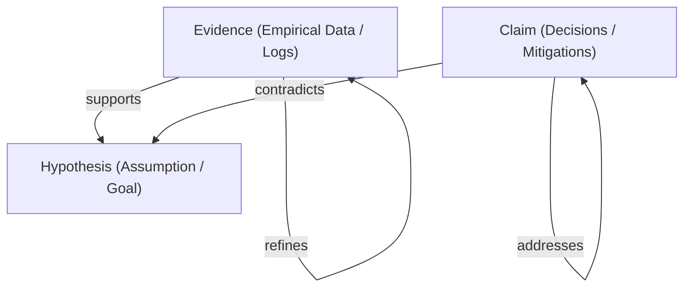

# METHODOLOGY: Epistemic Reasoning & Client Work Regulation

**Document ID**: EPIOS-CLI-001  
**Owner**: @architect / Customer Success  
**Status**: accepted_contract  
**Version**: 1.0  
**Last Updated**: 2026-05-17  
**Binding Level**: Mandatory for Client Workspaces  

---

## 1. Introduction & Core Concept

**Epistemic OS (EPIOS)** is not a drawing board or a wiki; it is a **Structured Reasoning Operating System**. 

Traditional decision-making platforms (e.g., Confluence, Miro, FigJam) treat corporate knowledge as raw text or isolated visual diagrams. This leads to **hidden logical contradictions**, **unverifiable assumptions**, and **cognitive overload**.

EPIOS enforces a rigorous mathematical and logical model of beliefs called the **Epistemic Graph**. Every workspace in EPIOS represents a logical model of a system under design, structured into discrete nodes (beliefs) and semantic connections (relations) that are systematically audited by the kernel.

This regulation defines how clients must structure their reasoning within EPIOS to achieve absolute clarity, automatic conflict detection, and mathematical rigor.

---

## 2. The Epistemic Taxonomy (Regulations)

To ensure consistency and automatic logical validation by the EPIOS kernel, all workspaces must strictly adhere to the following node and connection taxonomy.



### 2.1 Node Types

| Node Type | Icon | Code Ident | Semantic Definition | Client Rule |
| :--- | :---: | :--- | :--- | :--- |
| **Hypothesis** | 💡 | `HYPOTHESIS` | A proposed strategy, assumption, core architecture option, or high-level project goal under test. | Must represent an evaluative target that requires backing by evidence or mitigation of risks. |
| **Evidence** | 🗄️ | `EVIDENCE` | Unbiased, empirical inputs, verified data, telemetry logs, industry benchmarks, or physical facts. | Must be verifiable, grounded in a specific source (with URL/ID), and free from opinion. |
| **Claim** | 📄 | `CLAIM` | Logical arguments, evaluations, derived constraints, or technical options designed to address hypotheses or risks. | Must outline the technical mechanism, trade-offs, or concrete design decisions. |

### 2.2 Relationship Types (Edges)

Every connection in an Epistemic Graph has a mathematical direction (`source -> target`) and a semantic type:

1.  **SUPPORTS (`var(--success)` / Green)**:
    *   **Definition**: The source node strengthens or verifies the target node.
    *   **Rule**: Evidence supports a Hypothesis; verified benchmarks support a Claim.
2.  **CONTRADICTS (`var(--accent)` / Rose-Red)**:
    *   **Definition**: The source node invalidates, weakens, or highlights a risk/conflict in the target node.
    *   **Rule**: A Claim (identifying a trade-off) contradicts a Hypothesis; an empirical Observation showing failure contradicts a design Claim.
3.  **REFINES (`var(--primary)` / Blue)**:
    *   **Definition**: The source node provides critical details, limitations, or deeper context to the target node.
    *   **Rule**: Detailed sub-observations refine a parent Evidence node.
4.  **ADDRESSES (`var(--primary)` / Blue)**:
    *   **Definition**: The source node mitigates, solves, or bridges a conflict/risk identified in another node.
    *   **Rule**: A technical mitigation Claim addresses a risk Claim or a contested Hypothesis.

---

## 3. The 4-Step Epistemic Workflow

Every client project (Workspace) must evolve through the **Spiral Epistemic Lifecycle**:

```
[1. Formulate Hypothesis] ---> [2. Ground with Evidence]
           ^                                |
           |                                v
[4. Audit & Resolve Tensions] <--- [3. Map Claims & Risks]
```

1.  **Formulate Hypothesis**: State the core design or business assumption (e.g., "Suez Rerouting minimizes logistics impact").
2.  **Ground with Evidence**: Input real-world facts (e.g., "Suez congestion telemetry shows 320 ships").
3.  **Map Claims & Risks**: Define technical decisions and outline immediate trade-offs or constraints (e.g., "Air freight increases cost by 400%").
4.  **Audit & Resolve Tensions**: Run the EPIOS compiler. The kernel highlights red links (Tensions). Workplaces cannot transition to `verified` state until all contradictions are either **addressed** by mitigation claims or **supported** by stronger empirical evidence.

---

## 4. Quality Governance (The Complete Audit Checklist)

A Client Workspace is officially **invalidated** and rejected by the QA pipeline if it violates any of the following rules:

*   **Rule of Purity**: No node may contain generic, ungrounded placeholder text (e.g., "Detail #1", "Argument #2"). Every statement must be complete, specific, and self-contained.
*   **Rule of Grounding**: Every high-level `Hypothesis` must have at least one incoming `supports` relation from `Evidence`, or one `addresses` relation from a mitigating `Claim`.
*   **Rule of Conflict Resolution**: Any incoming `contradicts` (Rose-Red) edge to a node must be balanced by an outgoing `addresses` (Blue) edge from a mitigating node to prevent unmitigated project risk.
*   **Rule of Hierarchy**: Workspaces must avoid raw linear chains (`A -> B -> C -> D`). Cognitive processes are networked and multi-dimensional; maps must represent true logical trees or DAGs.

---

> [!IMPORTANT]
> Adhering to these regulations is the only way to activate the automatic mathematical evaluation and AI-agent verification within the Epistemic OS kernel. Maps that are purely visual without strict semantic links will fail the QA compilation gate.
