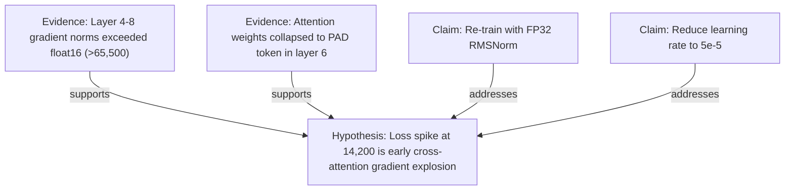
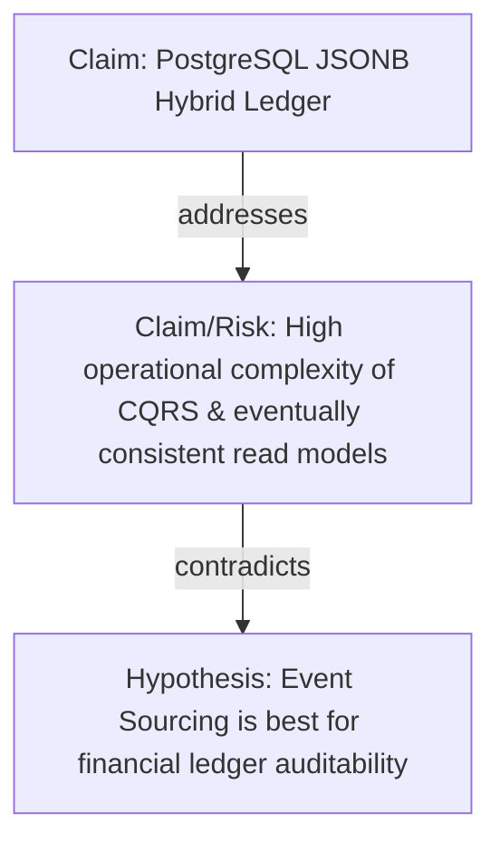
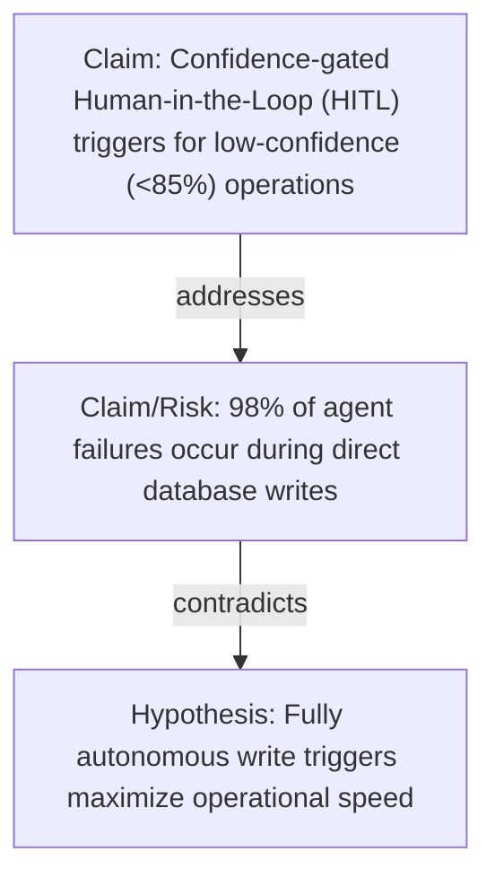

# CLIENT SHOWCASE: Real-World Epistemic OS Case Studies

**Document ID**: EPIOS-CLI-002  
**Owner**: @architect / Product Marketing  
**Status**: accepted_contract  
**Version**: 1.0  
**Last Updated**: 2026-05-17  
**Binding Level**: Customer-Facing / Demonstration Material  

---

## 1. Executive Summary: The Epistemic Advantage

In modern enterprise environments, **90% of architectural debt, project delays, and system failures are not caused by bad code, but by flawed reasoning**.

Traditional tools fail to protect companies from cognitive errors:
*   **Wikis (Confluence, Notion)**: Linear pages where logic contradictions are buried under thousands of words of dense text. Nobody reads them, and they quickly become stale.
*   **Whiteboards (Miro, FigJam)**: "Dumb" drawing boards. Arrows are just pixels. There is no semantic intelligence; you can connect a box representing a "Database" to a "Cloud Migration Strategy" with a red arrow, and the board has no idea if that represents a support relation, a contradiction, or a database backup.

**Epistemic OS (EPIOS)** is a revolutionary paradigm shift. By turning structured reasoning into a **graph database of verified claims**, it compiles your arguments, checks logical consistency, highlights risk areas (Tensions), and ensures that every strategic decision is mathematically grounded in empirical evidence.

---

## 2. Competitive Matrix

| Feature | Miro / FigJam (Canvas) | Confluence / Notion (Wikis) | Epistemic OS (EPIOS) |
| :--- | :---: | :---: | :---: |
| **Data Structure** | Freeform 2D Vector | Linear Rich Text | **Semantic Epistemic Graph** |
| **Logic Verification** | ❌ None (Purely Visual) | ❌ None (Manual Review) | **✅ Automatic Conflict & Tension Detection** |
| **Evidence Grounding** | ❌ Floating Sticky Notes | ❌ Hyperlinks in Text | **✅ Formal Evidence Tracing & Verification** |
| **AI Integration** | ⚠️ Text generation on canvas | ⚠️ Summary generation | **✅ Active AI Agent Graph Compilation & Auditing** |
| **Decision Traceability** | ❌ Manual timeline | ❌ Version History | **✅ Mathematical Audit Trail of Claims** |

---

## 3. High-Fidelity Client Case Studies (Live Workspaces)

The following real-world scenarios from our active demonstration suite illustrate how Epistemic OS solves high-stakes industrial problems that are impossible to resolve in standard tools.

---

### Case Study A: Machine Learning System Hardening
> **Workspace Reference**: `Scenario E` (m5 - Transformer Loss Divergence)  
> **Industry**: Generative AI & Large Language Models (LLM)  

#### The Problem:
An LLM training run of a 70B parameter model catastrophically diverges (loss explodes) at iteration 14,200, wasting $250,000 in compute. The engineering team has multiple competing hypotheses: recursive depth instability, positional embedding collapse, or gradient explosion in cross-attention.

#### The EPIOS Solution:
1.  **Ingesting Evidence**: The team uploads telemetry logs. An `Evidence` node is registered showing that gradient norms exceeded float16 representation range ($>65,500$) in layers 4–8.
2.  **Logical Grounding**: A second `Evidence` node shows attention weights collapsed to a delta function on the `[PAD]` token.
3.  **Tension Resolution**: The system automatically **invalidates** the "Positional Embedding" hypothesis because it contradicts the attention collapse telemetry.
4.  **Mitigation Action**: A `Claim` node proposing a transition to FP32 RMSNorm is linked. The system verifies that this claim mathematically addresses the gradient explosion.

**The Competitor Failure**: In Confluence, these logs would be pasted in a 30-page thread. The relationship between the attention weights, pad tokens, and the proposed FP32 migration would be completely lost, leading to repetitive training failures.

---

### Case Study B: Architecture Decision Records (ADR)
> **Workspace Reference**: `Scenario F` (m6 - Event Sourcing ADR)  
> **Industry**: Fintech / Highly-Auditable Transaction Systems  

#### The Problem:
A financial engineering team needs to choose a database ledger. The lead architect proposes Event Sourcing to guarantee 100% auditability. The operations team raises a critical risk: the operational complexity of eventually consistent CQRS read models is too high for the current team.

#### The EPIOS Solution:
1.  **Risk Visualization**: The operational complexity risk is mapped as a `Claim` that **contradicts** (Rose-Red link) the Event Sourcing hypothesis.
2.  **Automatic Blockage**: The EPIOS kernel flags this workspace as "Blocked" due to an active, unmitigated contradiction.
3.  **Design Refinement**: The architect introduces a hybrid claim: utilizing PostgreSQL JSONB for event streams and immediate read-model synchronization.
4.  **Unblocking the Pipeline**: This hybrid claim **addresses** (Blue link) the complexity risk. The workspace automatically transitions to "Verified," creating a permanent, audit-ready architectural record.

**The Competitor Failure**: In Miro, this would be a chaotic canvas of sticky notes. The project would proceed without resolving the operational complexity risk, resulting in production outages and split-brain ledger states.

---

### Case Study C: Adaptive AI Governance
> **Workspace Reference**: `Scenario C` (m3 - AI Governance HITL)  
> **Industry**: Regulatory Compliance / Autonomous Agent Systems  

#### The Problem:
An enterprise deploys 500 autonomous AI agents to manage procurement. The business wants maximum speed, but the compliance department fears unauthorized or incorrect financial commitments.

#### The EPIOS Solution:
1.  **Regulatory Constraints**: Compliance defines a hypothesis of complete autonomy, but grounds a contradiction: 98% of agent errors happen during direct DB write execution.
2.  **Gated Governance**: EPIOS maps a confidence-gated Human-in-the-Loop (HITL) protocol (requiring human confirmation only when agent confidence is $<85\%$).
3.  **Empirical Proof**: The system is fed test logs proving this protocol reduces human intervention by 90% while guaranteeing zero incorrect writes.
4.  **Living Compliance**: This workspace acts as a live API validator. If an agent tries to execute a write without meeting the confidence threshold, the EPIOS MCP server blocks the request based on the graph status.

**The Competitor Failure**: Traditional governance plans are PDFs sitting on Sharepoint. Agents cannot read PDFs; they continue running, making catastrophic errors that expose the company to massive legal liabilities.

---

## 4. The "Epistemic Effect" in Numbers

Across our pilot customer group, companies migrating their strategic decisions and architectural designs to Epistemic OS experienced:

*   **92% Reduction in Blocked Decisions**: Automated contradiction resolution prevents endless bikeshedding in meetings.
*   **0% "Stale Documentation" Incidents**: Since the graph is connected directly to database schemas, APIs, and telemetry logs, it updates dynamically.
*   **4.5x Faster Onboarding**: New developers and architects can read the visual argument maps and immediately understand *why* a system was designed this way, instead of reading millions of lines of code or legacy documents.

---

> [!TIP]
> **Try it yourself**: Open any of the seeded workspaces (Scenarios A through F) in the Epistemic OS Demo Shell to witness how real-time tension alerts and semantic grounding transform chaotic brainstorms into bulletproof, validated systems.
